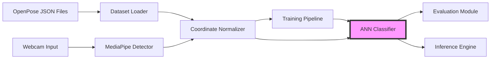

# Design Document: ANN-Based PSL Alphabet Recognition System

## Overview

This document describes the design of an Artificial Neural Network (ANN) based system for recognizing Pakistan Sign Language (PSL) alphabet hand poses. The system uses a feedforward neural network to classify static hand gestures representing Urdu alphabet characters based on 2D hand keypoint coordinates.

### System Purpose

The system enables real-time recognition of PSL alphabet signs by:
1. Loading pre-extracted hand keypoint data from OpenPose JSON files for training
2. Training a feedforward neural network on normalized hand coordinates
3. Performing real-time inference using MediaPipe hand detection on webcam input
4. Supporting extensibility from the current 23 classes to the full 38-40 Urdu alphabet

### Key Design Decisions

**Why Feedforward ANN over CNN/RNN:**
- Input is structured coordinate data (42 dimensions), not raw images
- No spatial locality to exploit (unlike images where CNNs excel)
- No temporal sequence (static poses, not dynamic gestures)
- Feedforward networks are simpler, faster, and sufficient for coordinate-based classification

**Why OpenPose for Training, MediaPipe for Inference:**
- OpenPose provides high-quality offline keypoint extraction for dataset creation
- MediaPipe offers real-time performance suitable for webcam inference
- Both produce 21-landmark hand models with compatible coordinate structures
- Normalization ensures consistency between the two detection systems

**Why Coordinate Normalization:**
- Translation invariance: Hand position in frame shouldn't affect classification
- Scale invariance: Hand size/distance from camera shouldn't affect classification
- Rotation preservation: Hand orientation is semantically meaningful for alphabet signs

### Architecture Summary

```
Input Pipeline:
  OpenPose JSON → Extract 21 landmarks → Normalize → 42D vector

Neural Network:
  Input (42) → FC1 (128) → BatchNorm → ReLU → Dropout(0.3)
            → FC2 (64) → BatchNorm → ReLU → Dropout(0.3)
            → FC3 (num_classes) → Logits

Training:
  Adam optimizer, CrossEntropyLoss, batch size 32
  Early stopping with patience 10, max 50 epochs
  Data augmentation: noise, rotation, scaling

Inference Pipeline:
  Webcam → MediaPipe → Extract 21 landmarks → Normalize → ANN → Prediction
```

## Architecture

### System Components

The system consists of six major components organized in a pipeline architecture:



### Component Responsibilities

**Dataset Loader** (`dataset_loader.py`)
- Recursively scans dataset directory for OpenPose JSON files
- Parses JSON and extracts `hand_right_keypoints_2d` arrays
- Filters invalid samples (empty people array, all-zero coordinates)
- Creates integer label encoding from folder names (alphabetical order)
- Performs stratified train/validation/test split (70/15/15)
- Generates dataset statistics report

**Coordinate Normalizer** (`preprocessor.py`)
- Implements translation and scale invariant normalization
- Computes centroid of all 21 landmarks
- Translates coordinates to center at origin
- Scales by maximum bounding box dimension
- Handles degenerate cases (all landmarks identical)
- Outputs 42-dimensional normalized vectors

**ANN Classifier** (`model.py`)
- Feedforward neural network with 2 hidden layers
- Architecture: 42 → 128 → 64 → num_classes
- Batch normalization after each linear layer
- ReLU activation functions
- Dropout (p=0.3) for regularization
- Outputs raw logits (no softmax in forward pass)
- Provides `predict_proba()` and `predict()` methods

**Training Pipeline** (`train.py`)
- Loads dataset and creates PyTorch DataLoaders
- Implements data augmentation (noise, rotation, scaling)
- Uses Adam optimizer with learning rate 0.001
- Trains with CrossEntropyLoss
- Implements early stopping based on validation loss
- Logs training metrics to CSV
- Saves best model weights

**Evaluation Module** (`evaluate.py`)
- Loads trained model and test set
- Computes accuracy, precision, recall, F1-score
- Generates confusion matrix (text and PNG visualization)
- Identifies problematic classes (F1 < 0.70)
- Saves comprehensive evaluation report

**Inference Engine** (`demo.py`)
- Captures webcam video frames
- Uses MediaPipe to detect hand landmarks in real-time
- Normalizes detected coordinates
- Runs ANN forward pass to get predictions
- Displays predicted alphabet with confidence
- Renders hand landmarks on video frame
- Supports confidence thresholding (default 0.70)

### Data Flow

**Training Flow:**
```
1. Dataset Loader reads JSON files → raw coordinates (N, 42)
2. Coordinate Normalizer processes → normalized coordinates (N, 42)
3. Training Pipeline applies augmentation → augmented batches (32, 42)
4. ANN Classifier forward pass → logits (32, num_classes)
5. CrossEntropyLoss computes loss → scalar
6. Adam optimizer updates weights
7. Validation evaluates → metrics (loss, accuracy)
8. Early stopping monitors → save best model
```

**Inference Flow:**
```
1. Webcam captures frame → RGB image
2. MediaPipe detects hand → 21 landmarks (x, y)
3. Extract coordinates → raw coordinates (42,)
4. Coordinate Normalizer processes → normalized coordinates (42,)
5. ANN Classifier forward pass → logits (num_classes,)
6. Softmax converts → probabilities (num_classes,)
7. Argmax selects → predicted class index
8. Confidence threshold filters → display prediction or "Low Confidence"
```

### Technology Stack

**Core Framework:**
- PyTorch 2.x: Neural network implementation and training
- NumPy: Numerical operations and array manipulation

**Computer Vision:**
- MediaPipe: Real-time hand landmark detection
- OpenCV (cv2): Video capture and frame processing

**Machine Learning Utilities:**
- scikit-learn: Dataset splitting, metrics computation
- Matplotlib: Confusion matrix visualization

**Development:**
- Python 3.8+: Programming language
- Windows: Target operating system

## Components and Interfaces

### Dataset Loader Interface

**Module:** `dataset_loader.py`

**Primary Function:**
```python
def load_dataset(
    root_dir: str = DATASET_ROOT,
    train_split: float = 0.70,
    val_split: float = 0.15,
    test_split: float = 0.15,
) -> Tuple[
    Tuple[np.ndarray, np.ndarray],  # (X_train, y_train)
    Tuple[np.ndarray, np.ndarray],  # (X_val, y_val)
    Tuple[np.ndarray, np.ndarray],  # (X_test, y_test)
    Dict[int, str],                  # label_map
]:
```

**Helper Function:**
```python
def extract_right_hand_coords(json_path: Path) -> Optional[np.ndarray]:
    """
    Extracts 42D coordinate vector from OpenPose JSON.
    Returns None if invalid (empty people, wrong length, all zeros).
    """
```

**Input:** Directory path to `alphabets_dataset/`
**Output:** Train/val/test splits + label mapping dictionary
**Error Handling:** Logs warnings for invalid files, skips and continues

### Coordinate Normalizer Interface

**Module:** `preprocessor.py`

**Primary Function:**
```python
def normalize_hand_coords(coords: np.ndarray) -> np.ndarray:
    """
    Normalizes hand coordinates for translation and scale invariance.
    
    Args:
        coords: Shape (42,) or (21, 2)
    
    Returns:
        Normalized coordinates, shape (42,)
    """
```

**Algorithm:**
1. Reshape to (21, 2) if flat
2. Compute centroid: `mean(coords, axis=0)`
3. Translate: `coords - centroid`
4. Compute bounding box: `max - min`
5. Scale: `coords / max(bbox_width, bbox_height)`
6. Return flattened (42,)

**Properties:**
- Translation invariant: `normalize(coords + offset) == normalize(coords)`
- Scale invariant: `normalize(coords * scale) == normalize(coords)` for scale > 0
- Rotation variant: Preserves hand orientation (intentional)

### ANN Classifier Interface

**Module:** `model.py`

**Class Definition:**
```python
class AlphabetClassifier(nn.Module):
    def __init__(
        self,
        input_dim: int = 42,
        hidden_dim_1: int = 128,
        hidden_dim_2: int = 64,
        num_classes: int = NUM_CLASSES,
        dropout: float = 0.3,
    ):
```

**Methods:**
```python
def forward(self, x: torch.Tensor) -> torch.Tensor:
    """
    Args: x shape (batch_size, 42)
    Returns: logits shape (batch_size, num_classes)
    """

def predict_proba(self, x: torch.Tensor) -> torch.Tensor:
    """
    Returns: probabilities shape (batch_size, num_classes)
    Each row sums to 1.0
    """

def predict(self, x: torch.Tensor) -> torch.Tensor:
    """
    Returns: class indices shape (batch_size,)
    """
```

**Architecture Details:**
- Layer 1: Linear(42, 128) + BatchNorm1d(128) + ReLU + Dropout(0.3)
- Layer 2: Linear(128, 64) + BatchNorm1d(64) + ReLU + Dropout(0.3)
- Layer 3: Linear(64, num_classes)
- Parameter count: ~15,000 (with 23 classes)

### Training Pipeline Interface

**Module:** `train.py`

**Main Function:**
```python
def train_model(
    model: AlphabetClassifier,
    train_loader: DataLoader,
    val_loader: DataLoader,
    optimizer: torch.optim.Optimizer,
    criterion: nn.Module,
    max_epochs: int = 50,
    patience: int = 10,
) -> AlphabetClassifier:
```

**Data Augmentation:**
```python
def augment_coordinates(coords: np.ndarray) -> np.ndarray:
    """
    Applies random transformations:
    - Gaussian noise: N(0, 0.02)
    - Rotation: uniform(-15°, +15°) around wrist
    - Scaling: uniform(0.9, 1.1)
    """
```

**Training Loop:**
1. For each epoch:
   - Train on batches with augmentation
   - Validate without augmentation
   - Log metrics to CSV
   - Check early stopping condition
2. Restore best weights
3. Save model to `alphabet_classifier.pt`

### Evaluation Module Interface

**Module:** `evaluate.py`

**Main Function:**
```python
def evaluate_model(
    model: AlphabetClassifier,
    test_loader: DataLoader,
    label_map: Dict[int, str],
) -> Dict[str, Any]:
    """
    Returns:
        {
            'accuracy': float,
            'precision': np.ndarray,  # per-class
            'recall': np.ndarray,     # per-class
            'f1_score': np.ndarray,   # per-class
            'confusion_matrix': np.ndarray,
            'macro_f1': float,
            'weighted_f1': float,
        }
    """
```

**Outputs:**
- `evaluation_report.txt`: Text report with all metrics
- `confusion_matrix.txt`: Text representation of confusion matrix
- `confusion_matrix.png`: Heatmap visualization

### Inference Engine Interface

**Module:** `demo.py`

**Main Function:**
```python
def run_webcam_demo(
    model: AlphabetClassifier,
    label_map: Dict[int, str],
    confidence_threshold: float = 0.70,
) -> None:
    """
    Runs real-time webcam demo with MediaPipe hand detection.
    Press 'q' to quit.
    """
```

**Processing Pipeline:**
1. Capture frame from webcam
2. MediaPipe detects hand landmarks
3. Extract 21 (x, y) coordinates
4. Normalize coordinates
5. Run model inference
6. Apply confidence threshold
7. Render prediction on frame
8. Display frame

**Visual Feedback:**
- Green text: High confidence (≥0.85)
- Yellow text: Medium confidence (0.70-0.84)
- Red text: Low confidence (<0.70) or "No hand detected"
- Hand landmarks rendered as circles with connections

## Data Models

### OpenPose JSON Format

**File Structure:**
```json
{
  "version": 1.3,
  "people": [
    {
      "person_id": [-1],
      "pose_keypoints_2d": [...],
      "hand_right_keypoints_2d": [
        x0, y0, c0,
        x1, y1, c1,
        ...,
        x20, y20, c20
      ],
      "hand_left_keypoints_2d": [...]
    }
  ]
}
```

**Hand Keypoints Array:**
- Length: 63 elements (21 landmarks × 3 values)
- Format: `[x, y, confidence]` triplets
- Coordinate system: Pixel coordinates in original image
- Landmark order: Wrist (0), Thumb (1-4), Index (5-8), Middle (9-12), Ring (13-16), Pinky (17-20)

**Landmark Indices:**
```
0:  Wrist
1-4:  Thumb (CMC, MCP, IP, Tip)
5-8:  Index (MCP, PIP, DIP, Tip)
9-12:  Middle (MCP, PIP, DIP, Tip)
13-16: Ring (MCP, PIP, DIP, Tip)
17-20: Pinky (MCP, PIP, DIP, Tip)
```

### Normalized Coordinate Vector

**Format:** NumPy array of shape (42,)
**Data Type:** float32
**Value Range:** Approximately [-1, 1] (not strictly bounded)

**Structure:**
```
[x0, y0, x1, y1, x2, y2, ..., x20, y20]
```

**Properties:**
- Centroid at origin: `mean(coords) ≈ 0`
- Scaled by max bounding box dimension
- Preserves aspect ratio
- Rotation variant (orientation preserved)

### Label Encoding

**Label Map:** Dictionary mapping integer indices to alphabet strings
```python
{
    0: "++",
    1: "++ü",
    2: "++ے",
    ...
    22: "ی"
}
```

**Encoding Strategy:**
- Alphabetical order of folder names
- Deterministic (same order every run)
- Integer labels: 0 to (num_classes - 1)
- Supports dynamic class count detection

### Dataset Splits

**Training Set:**
- 70% of total samples
- Stratified by class
- Augmentation applied during training

**Validation Set:**
- 15% of total samples
- Stratified by class
- No augmentation
- Used for early stopping

**Test Set:**
- 15% of total samples
- Stratified by class
- No augmentation
- Used for final evaluation

**Data Structure:**
```python
X_train: np.ndarray  # Shape: (N_train, 42), dtype: float32
y_train: np.ndarray  # Shape: (N_train,), dtype: int64

X_val: np.ndarray    # Shape: (N_val, 42), dtype: float32
y_val: np.ndarray    # Shape: (N_val,), dtype: int64

X_test: np.ndarray   # Shape: (N_test, 42), dtype: float32
y_test: np.ndarray   # Shape: (N_test,), dtype: int64
```

### Model Checkpoint Format

**File:** `alphabet_classifier.pt`
**Format:** PyTorch state dictionary

**Contents:**
```python
{
    'fc1.weight': torch.Tensor,  # Shape: (128, 42)
    'fc1.bias': torch.Tensor,    # Shape: (128,)
    'bn1.weight': torch.Tensor,  # Shape: (128,)
    'bn1.bias': torch.Tensor,    # Shape: (128,)
    'bn1.running_mean': torch.Tensor,
    'bn1.running_var': torch.Tensor,
    'bn1.num_batches_tracked': torch.Tensor,
    # ... (similar for fc2, bn2, fc3)
}
```

**Loading:**
```python
model = AlphabetClassifier(num_classes=23)
model.load_state_dict(torch.load('alphabet_classifier.pt'))
model.eval()
```

### Training Log Format

**File:** `training_log.csv`
**Format:** CSV with header

**Columns:**
```
epoch,train_loss,val_loss,val_accuracy
1,2.3456,2.1234,0.3456
2,1.9876,1.8765,0.4567
...
```

### Evaluation Report Format

**File:** `evaluation_report.txt`
**Format:** Plain text

**Structure:**
```
Overall Accuracy: 0.8523

Per-Class Metrics:
Class: ++
  Precision: 0.8765
  Recall: 0.8432
  F1-Score: 0.8596

Class: ++ü
  Precision: 0.7654
  Recall: 0.7890
  F1-Score: 0.7770

...

Macro-Averaged F1: 0.8234
Weighted-Averaged F1: 0.8456

Problematic Classes (F1 < 0.70):
  - Class X: F1 = 0.6543
  - Class Y: F1 = 0.6789
```

### Confusion Matrix Format

**Text File:** `confusion_matrix.txt`
**Format:** Space-separated matrix with row/column labels

**PNG File:** `confusion_matrix.png`
**Format:** Matplotlib heatmap with:
- Alphabet labels on axes
- Color scale indicating frequency
- Annotations showing counts
- Title: "Confusion Matrix - PSL Alphabet Recognition"


## Correctness Properties

*A property is a characteristic or behavior that should hold true across all valid executions of a system—essentially, a formal statement about what the system should do. Properties serve as the bridge between human-readable specifications and machine-verifiable correctness guarantees.*

This section defines universal properties that the ANN alphabet recognition system must satisfy. These properties are designed for property-based testing, where each property is verified across many randomly generated inputs to ensure correctness across the entire input space.

### Property 1: Translation Invariance of Normalization

*For any* valid hand coordinate array and any 2D translation offset, normalizing the translated coordinates SHALL produce the same result as normalizing the original coordinates.

**Validates: Requirements 3.1, 3.2, 3.3**

**Rationale:** The normalization algorithm centers coordinates at the origin, making the system invariant to hand position in the frame. This ensures that a hand gesture is recognized regardless of where it appears in the image.

**Test Strategy:** Generate random coordinate arrays and random translation vectors. Verify that `normalize(coords + offset) ≈ normalize(coords)` within numerical tolerance.

### Property 2: Scale Invariance of Normalization

*For any* valid hand coordinate array and any positive scaling factor, normalizing the scaled coordinates SHALL produce the same result as normalizing the original coordinates.

**Validates: Requirements 3.3**

**Rationale:** The normalization algorithm scales by the maximum bounding box dimension, making the system invariant to hand size and distance from camera. This ensures that hand gestures are recognized regardless of how close or far the hand is from the camera.

**Test Strategy:** Generate random coordinate arrays and random positive scale factors. Verify that `normalize(coords * scale) ≈ normalize(coords)` within numerical tolerance.

### Property 3: Normalization Output Shape Consistency

*For any* valid input coordinate array (either shape (42,) or (21, 2)), the normalized output SHALL always be a flat array of shape (42,) with dtype float32.

**Validates: Requirements 3.6**

**Rationale:** Consistent output shape ensures compatibility with the neural network input layer, which expects exactly 42 features.

**Test Strategy:** Generate random coordinate arrays in both flat (42,) and reshaped (21, 2) formats. Verify output shape is always (42,) and dtype is float32.

### Property 4: Coordinate Array Conversion Correctness

*For any* 63-element array representing OpenPose hand keypoints (x, y, confidence triplets), extracting x and y coordinates SHALL produce a 42-element array where element 2i is the x-coordinate of landmark i and element 2i+1 is the y-coordinate of landmark i.

**Validates: Requirements 1.3**

**Rationale:** Correct extraction of x, y pairs from OpenPose format is critical for proper hand pose representation. Confidence values are discarded as they are not used in classification.

**Test Strategy:** Generate random 63-element arrays. Verify that the output has 42 elements and that `output[2*i] == input[3*i]` and `output[2*i+1] == input[3*i+1]` for all landmarks i in [0, 20].

### Property 5: Label Encoding Alphabetical Ordering

*For any* set of alphabet folder names, the integer label encoding SHALL assign labels in alphabetical order, such that if folder name A comes before folder name B alphabetically, then label(A) < label(B).

**Validates: Requirements 1.6**

**Rationale:** Deterministic alphabetical ordering ensures consistent label assignment across different runs and different machines, which is critical for model reproducibility.

**Test Strategy:** Generate random sets of folder names. Create label encoding and verify that labels are assigned in alphabetical order of folder names.

### Property 6: Label Map Inversion Correctness

*For any* label encoding dictionary mapping folder names to integer labels, the label map (inverse mapping) SHALL correctly map each integer label back to its corresponding folder name, such that `label_map[label_encoding[name]] == name` for all folder names.

**Validates: Requirements 1.7**

**Rationale:** The label map must be the exact inverse of the label encoding to ensure predictions can be correctly decoded back to alphabet strings.

**Test Strategy:** Generate random label encodings. Create label map and verify that `label_map[label_encoding[name]] == name` for all names.

### Property 7: Dataset Split Proportion Correctness

*For any* dataset with at least 100 samples, splitting with proportions (train=0.70, val=0.15, test=0.15) SHALL produce splits where the actual proportions are within 5% of the target proportions.

**Validates: Requirements 2.1**

**Rationale:** Correct split proportions ensure that the model is trained on sufficient data while reserving adequate data for validation and testing. The 5% tolerance accounts for rounding when dealing with discrete sample counts.

**Test Strategy:** Generate random datasets of varying sizes (100-10000 samples). Perform splitting and verify that `|actual_proportion - target_proportion| < 0.05` for each split.

### Property 8: Stratified Split Class Distribution Preservation

*For any* dataset with multiple classes, stratified splitting SHALL preserve the class distribution in each split, such that the proportion of each class in train/val/test splits is within 10% of the proportion in the original dataset.

**Validates: Requirements 2.2**

**Rationale:** Stratified sampling ensures that rare classes are represented in all splits, preventing the model from never seeing certain classes during training or evaluation.

**Test Strategy:** Generate random datasets with known class distributions (including imbalanced classes). Perform stratified splitting and verify that class proportions in each split are within 10% of the original proportions.

### Property 9: Data Augmentation Parameter Bounds

*For any* coordinate array subjected to data augmentation, the applied transformations SHALL satisfy: (1) added noise has standard deviation ≤ 0.03, (2) rotation angle is in [-15°, +15°], and (3) scaling factor is in [0.9, 1.1].

**Validates: Requirements 4.1, 4.2, 4.3**

**Rationale:** Augmentation parameters must stay within reasonable bounds to ensure augmented samples remain realistic and don't introduce unrealistic hand poses that would hurt model generalization.

**Test Strategy:** Generate random coordinate arrays. Apply augmentation many times (100+ iterations). For noise, compute empirical standard deviation and verify ≤ 0.03. For rotation and scaling, track applied values and verify all are within bounds.

### Property 10: Rotation Preserves Wrist Position

*For any* normalized coordinate array (where wrist is at origin), applying rotation augmentation around the wrist SHALL keep the wrist at the origin (within numerical tolerance of 0.01).

**Validates: Requirements 4.6**

**Rationale:** Rotation should be applied around the wrist as the center of rotation, preserving the translation invariance property of normalized coordinates.

**Test Strategy:** Generate random normalized coordinate arrays (wrist at origin). Apply rotation augmentation. Verify that the wrist coordinates (first x, y pair) remain within 0.01 of (0, 0).

### Property 11: Model State Dictionary Round-Trip Preservation

*For any* trained AlphabetClassifier model, saving the state dictionary to a file and loading it back SHALL produce a model with identical weights (within numerical tolerance of 1e-6).

**Validates: Requirements 12.1, 12.2, 12.3, 12.4**

**Rationale:** Model persistence must preserve all learned parameters exactly to ensure consistent predictions across different sessions.

**Test Strategy:** Create models with random weights. Save state dictionary to temporary file, load it back, and verify that all parameters match within tolerance of 1e-6.

### Property 12: Batch Inference Output Shape Consistency

*For any* batch of normalized coordinate arrays with shape (batch_size, 42), the model forward pass SHALL produce logits with shape (batch_size, num_classes) where num_classes matches the model's output layer size.

**Validates: Requirements 18.1, 18.2**

**Rationale:** Batch processing must maintain correct tensor shapes to enable efficient evaluation and inference on multiple samples simultaneously.

**Test Strategy:** Generate random batches of varying sizes (1, 16, 32, 64, 128). Run forward pass and verify output shape is (batch_size, num_classes).

### Property 13: Coordinate Validation Range Checking

*For any* normalized coordinate array, all coordinate values SHALL be within the range [-2, 2], and at least 90% of values SHALL be within [-1, 1].

**Validates: Requirements 15.2, 15.3**

**Rationale:** Normalized coordinates should be approximately in [-1, 1] range due to the scaling algorithm. The [-2, 2] bound provides a safety check for outliers, while the 90% threshold ensures most coordinates are properly normalized.

**Test Strategy:** Generate random raw coordinate arrays, normalize them, and verify that all values are in [-2, 2] and at least 90% are in [-1, 1].

## Error Handling

### Dataset Loading Errors

**Invalid JSON Files:**
- **Error:** JSON parsing fails due to malformed syntax
- **Handling:** Log error with file path, skip file, continue loading
- **User Impact:** Reduced dataset size, warning in logs
- **Recovery:** Manual inspection and correction of JSON file

**Missing Hand Data:**
- **Error:** `people` array is empty or `hand_right_keypoints_2d` is missing
- **Handling:** Log warning with file path, skip file, continue loading
- **User Impact:** Reduced dataset size, warning in logs
- **Recovery:** Re-run OpenPose on source images to regenerate keypoints

**Invalid Coordinate Data:**
- **Error:** All coordinates are zero (failed detection)
- **Handling:** Log warning with file path, skip file, continue loading
- **User Impact:** Reduced dataset size, warning in logs
- **Recovery:** Manual review of source images, possible re-recording

**Insufficient Data:**
- **Error:** Fewer than 2 classes or fewer than 100 total samples loaded
- **Handling:** Raise `ValueError` with descriptive message, halt execution
- **User Impact:** Training cannot proceed
- **Recovery:** Add more data to dataset directory

### Normalization Errors

**Degenerate Hand Pose:**
- **Error:** All landmarks are identical (bounding box has zero size)
- **Handling:** Log warning, return zero vector of shape (42,)
- **User Impact:** Sample will likely be misclassified
- **Recovery:** Filter out zero vectors before training

**Invalid Input Shape:**
- **Error:** Input array is not shape (42,) or (21, 2)
- **Handling:** Raise `ValueError` with descriptive message
- **User Impact:** Execution halts
- **Recovery:** Fix data preprocessing pipeline to produce correct shapes

### Training Errors

**GPU Out of Memory:**
- **Error:** CUDA out of memory during training
- **Handling:** Catch exception, log error, suggest reducing batch size
- **User Impact:** Training halts
- **Recovery:** Reduce `BATCH_SIZE` in config.py or use CPU

**NaN Loss:**
- **Error:** Loss becomes NaN during training (gradient explosion)
- **Handling:** Detect NaN in loss, log error, halt training
- **User Impact:** Training fails, no model saved
- **Recovery:** Reduce learning rate, check data for outliers

**Early Stopping Triggered:**
- **Error:** Validation loss doesn't improve for `patience` epochs
- **Handling:** Stop training, restore best weights, save model
- **User Impact:** Training ends before max epochs
- **Recovery:** This is expected behavior, not an error

### Model Loading Errors

**Model File Not Found:**
- **Error:** `alphabet_classifier.pt` doesn't exist
- **Handling:** Raise `FileNotFoundError` with message "Model file not found. Run train.py first."
- **User Impact:** Inference/evaluation cannot proceed
- **Recovery:** Run `train.py` to train and save model

**Architecture Mismatch:**
- **Error:** Saved weights don't match current model architecture
- **Handling:** Raise `RuntimeError` with message about dimension mismatch
- **User Impact:** Model loading fails
- **Recovery:** Retrain model with current architecture or update architecture to match saved model

**Corrupted Model File:**
- **Error:** Model file is corrupted or incomplete
- **Handling:** Catch exception during `torch.load()`, raise descriptive error
- **User Impact:** Model loading fails
- **Recovery:** Delete corrupted file and retrain

### Inference Errors

**No Hand Detected:**
- **Error:** MediaPipe doesn't detect any hand in frame
- **Handling:** Display "No hand detected" on video frame, continue processing
- **User Impact:** No prediction shown for current frame
- **Recovery:** User adjusts hand position/lighting

**Low Confidence Prediction:**
- **Error:** Maximum class probability is below threshold (0.70)
- **Handling:** Display "Low Confidence" instead of prediction
- **User Impact:** User sees low confidence warning
- **Recovery:** User adjusts hand pose to be more clear

**Webcam Access Failure:**
- **Error:** Cannot open webcam (device busy or not found)
- **Handling:** Raise exception with message "Failed to open webcam"
- **User Impact:** Demo cannot run
- **Recovery:** Close other applications using webcam, check device connection

### File I/O Errors

**Permission Denied:**
- **Error:** Cannot write to output directory (logs, models, reports)
- **Handling:** Raise `PermissionError` with file path
- **User Impact:** Execution halts
- **Recovery:** Run with appropriate permissions or change output directory

**Disk Full:**
- **Error:** No space left on device when saving model/logs
- **Handling:** Raise `OSError` with descriptive message
- **User Impact:** Execution halts, outputs may be incomplete
- **Recovery:** Free up disk space, re-run

## Testing Strategy

### Testing Approach Overview

The testing strategy employs a **dual approach** combining property-based testing and example-based testing:

1. **Property-Based Testing (PBT):** Verifies universal properties across many randomly generated inputs (100+ iterations per property). Used for core data processing logic where behavior should hold for all valid inputs.

2. **Example-Based Unit Testing:** Verifies specific scenarios, edge cases, and integration points with concrete examples. Used for specific behaviors, error conditions, and integration with external systems.

3. **Integration Testing:** Verifies end-to-end workflows with real data and external dependencies (file system, MediaPipe, webcam).

### Property-Based Testing

**Framework:** Use `hypothesis` library for Python property-based testing.

**Test Configuration:**
- Minimum 100 iterations per property test
- Each test tagged with comment referencing design property
- Tag format: `# Feature: ann-alphabet-recognition, Property {number}: {property_text}`

**Properties to Test:**

1. **Normalization Properties (Properties 1-3, 13):**
   - Translation invariance
   - Scale invariance
   - Output shape consistency
   - Coordinate range validation
   - **Generators:** Random coordinate arrays (21, 2) with values in [0, 1920] × [0, 1080] (typical image dimensions)

2. **Data Processing Properties (Properties 4-6):**
   - Coordinate array conversion (63 → 42)
   - Label encoding alphabetical ordering
   - Label map inversion correctness
   - **Generators:** Random 63-element arrays, random folder name sets

3. **Dataset Splitting Properties (Properties 7-8):**
   - Split proportion correctness
   - Stratified sampling class distribution
   - **Generators:** Random datasets with varying sizes and class distributions

4. **Augmentation Properties (Properties 9-10):**
   - Parameter bounds (noise, rotation, scaling)
   - Rotation preserves wrist position
   - **Generators:** Random normalized coordinate arrays

5. **Model Persistence Property (Property 11):**
   - Save/load round-trip preservation
   - **Generators:** Models with random weights

6. **Batch Processing Property (Property 12):**
   - Output shape consistency
   - **Generators:** Random batch sizes and coordinate arrays

**Example Property Test Structure:**
```python
from hypothesis import given, strategies as st
import numpy as np

@given(
    coords=st.lists(
        st.floats(min_value=0, max_value=1920),
        min_size=42, max_size=42
    ).map(lambda x: np.array(x, dtype=np.float32).reshape(21, 2)),
    offset=st.tuples(
        st.floats(min_value=-500, max_value=500),
        st.floats(min_value=-500, max_value=500)
    )
)
def test_translation_invariance(coords, offset):
    """
    Feature: ann-alphabet-recognition, Property 1: Translation Invariance
    
    For any valid hand coordinates and translation offset,
    normalize(coords + offset) should equal normalize(coords).
    """
    from preprocessor import normalize_hand_coords
    
    offset_array = np.array(offset, dtype=np.float32)
    translated_coords = coords + offset_array
    
    normalized_original = normalize_hand_coords(coords)
    normalized_translated = normalize_hand_coords(translated_coords)
    
    np.testing.assert_allclose(
        normalized_original,
        normalized_translated,
        rtol=1e-5,
        atol=1e-6
    )
```

### Example-Based Unit Testing

**Framework:** Use `pytest` for unit testing.

**Test Categories:**

1. **Edge Cases:**
   - Empty people array in JSON (Requirement 1.4)
   - All-zero coordinates (Requirement 1.5)
   - Class with <50 samples warning (Requirement 2.5)
   - Degenerate hand pose (all landmarks identical)

2. **Specific Behaviors:**
   - Model architecture dimensions (Requirements 5.1-5.10)
   - Fixed random seed reproducibility (Requirement 2.3, 19.4)
   - Return type structure (Requirement 2.4)
   - Configuration parameters (Requirements 10.1-10.8)

3. **Error Conditions:**
   - Invalid JSON parsing
   - Missing model file
   - Architecture mismatch on load
   - Invalid input shapes

**Example Unit Test:**
```python
import pytest
from dataset_loader import extract_right_hand_coords

def test_empty_people_array_returns_none():
    """Test that JSON with empty people array returns None."""
    json_data = {"people": []}
    # Write to temp file and test
    # Should return None and log warning
    
def test_all_zero_coordinates_returns_none():
    """Test that all-zero coordinates are rejected."""
    json_data = {
        "people": [{
            "hand_right_keypoints_2d": [0.0] * 63
        }]
    }
    # Should return None and log warning
```

### Integration Testing

**Test Scenarios:**

1. **End-to-End Training Pipeline:**
   - Load actual dataset (23 classes, ~1700 samples)
   - Verify dataset statistics match expected ranges
   - Train model for 5 epochs (quick smoke test)
   - Verify model file is saved
   - Verify training log CSV is created
   - **Validates:** Requirements 1.8, 1.9, 6.1-6.9, 16.1-16.6

2. **End-to-End Evaluation Pipeline:**
   - Load trained model
   - Run evaluation on test set
   - Verify evaluation report is generated
   - Verify confusion matrix files are created
   - Check that accuracy is reasonable (>0.50 for 23 classes)
   - **Validates:** Requirements 7.1-7.8, 14.1-14.7

3. **Model Persistence Integration:**
   - Train small model
   - Save to file
   - Load from file
   - Verify predictions match
   - **Validates:** Requirements 12.1-12.7

4. **Command-Line Interface:**
   - Run `train.py` and verify completion
   - Run `evaluate.py` and verify completion
   - Run `run_pipeline.py` and verify all stages complete
   - **Validates:** Requirements 20.1-20.8

### Manual Testing

**Real-Time Inference Testing:**
- Run `demo.py` with webcam
- Test each of the 23 alphabet signs
- Verify predictions are displayed
- Verify confidence scores are shown
- Verify hand landmarks are rendered
- Test "No hand detected" scenario
- Test low confidence scenario
- Verify 'q' key quits application
- **Validates:** Requirements 8.1-8.10, 9.1-9.8

**Performance Testing:**
- Measure inference time per frame
- Verify frame rate ≥ 15 FPS
- Measure model forward pass time
- **Validates:** Requirements 17.1-17.5

### Test Organization

```
tests/
├── property_tests/
│   ├── test_normalization_properties.py
│   ├── test_augmentation_properties.py
│   ├── test_dataset_properties.py
│   └── test_model_properties.py
├── unit_tests/
│   ├── test_dataset_loader.py
│   ├── test_preprocessor.py
│   ├── test_model.py
│   └── test_config.py
├── integration_tests/
│   ├── test_training_pipeline.py
│   ├── test_evaluation_pipeline.py
│   └── test_cli.py
└── conftest.py  # Shared fixtures
```

### Test Coverage Goals

- **Property Tests:** 100% coverage of properties 1-13
- **Unit Tests:** >80% line coverage of core modules (dataset_loader, preprocessor, model)
- **Integration Tests:** All major workflows (train, evaluate, inference)
- **Manual Tests:** All user-facing features (webcam demo, CLI scripts)

### Continuous Testing

**Pre-commit Checks:**
- Run property tests (fast subset, 10 iterations)
- Run unit tests
- Check code formatting (black, flake8)

**CI Pipeline:**
- Run full property test suite (100 iterations)
- Run all unit tests
- Run integration tests (except webcam demo)
- Generate coverage report

**Release Testing:**
- Run full test suite
- Manual testing of webcam demo
- Performance benchmarking
- Test on clean environment with fresh install
