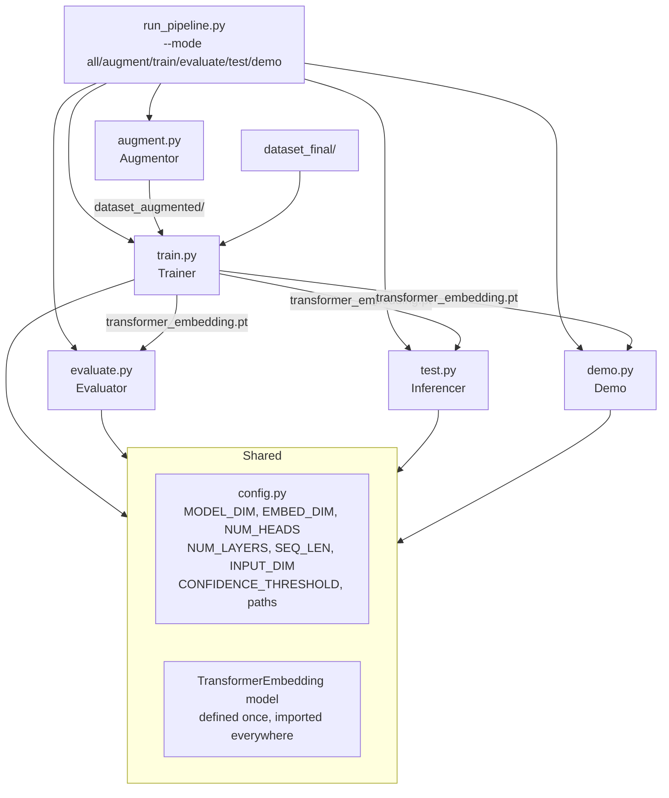

# Design Document: PSL Demo System

## Overview

The PSL Demo System is a Pakistan Sign Language recognition pipeline covering 5 signs: **condolences**, **Electric_Swtich**, **First_aid_box**, **Human_Rights**, and **Quraan**. The system is designed around a fundamental constraint: only 2 labelled keypoint sequences exist per class (10 total), making aggressive augmentation and honest evaluation critical.

The architecture follows a metric-learning approach:

1. **MediaPipe** extracts 225-dimensional keypoint vectors per frame (33 pose × 3 + 21 × 2 hands × 3).
2. A **Transformer encoder** trained with triplet loss maps 100-frame sequences to 128-dimensional L2-normalised embeddings.
3. At inference time, a **nearest-neighbour cosine similarity** search over a pre-built embedding database classifies the input.

The redesign addresses three concrete bugs in the existing code and introduces four new components:

| Bug | Location | Fix |
|-----|----------|-----|
| Missing `import json` | `test.py` | Added at top of file |
| Label extracted from filename stem (wrong) | `test.py` | Use `sign_folder.name` directly |
| Self-evaluation (tests on training data) | `emo.py` | Replaced with LOO-CV in `evaluate.py` |
| `MODEL_DIM=64` in `train.py` vs `128` in `emo.py` | both | Unified in `config.py` |

### Key Design Decisions

**Why metric learning + nearest-neighbour instead of a classifier head?**  
With only 2 samples per class, a softmax classifier would overfit immediately. Triplet loss trains the encoder to produce a well-structured embedding space; nearest-neighbour inference then generalises to new samples without retraining.

**Why LOO-CV instead of a train/val split?**  
With 10 original samples (2 per class), any fixed split leaves some classes with 0 validation samples. LOO-CV is the only statistically valid evaluation strategy at this scale.

**Why augmentation before training?**  
The augmented dataset (`dataset_augmented/`) is generated once and persisted as JSON, so training can be reproduced deterministically and the augmentation step does not slow down each training run.

---

## Architecture



### Data Flow


---

## Components and Interfaces

### `config.py` — Shared Constants

Single source of truth for all hyperparameters and paths. Every other module imports from here.

```python
# Model architecture
MODEL_DIM: int = 128
EMBED_DIM: int = 128
NUM_HEADS: int = 4
NUM_LAYERS: int = 2
SEQ_LEN: int = 100
INPUT_DIM: int = 225

# Inference
CONFIDENCE_THRESHOLD: float = 0.50

# Paths
DATASET_DIRS: list[str] = ["dataset_final", "dataset_augmented"]
MODEL_PATH: str = "transformer_embedding.pt"
AUGMENTED_DIR: str = "dataset_augmented"
EVAL_REPORT_PATH: str = "evaluation_report.txt"
TRAINING_LOG_PATH: str = "training_log.csv"
```

**Design rationale**: `DATASET_DIRS` is a list so the Trainer can iterate over both original and augmented data with a single loop. `CONFIDENCE_THRESHOLD` is centralised so the Demo and Inferencer always agree on what constitutes "Unknown".

---

### `augment.py` — Augmentor

Reads every JSON file from `dataset_final/`, applies stochastic transforms, and writes results to `dataset_augmented/`.

**Public interface:**

```python
def augment_sequence(seq: np.ndarray) -> np.ndarray:
    """Apply one or more random transforms to a (SEQ_LEN, INPUT_DIM) array.
    Returns a new array of the same shape."""

def run_augmentation(
    source_dir: str = "dataset_final",
    output_dir: str = AUGMENTED_DIR,
    augmentations_per_sample: int = 8,
) -> None:
    """Generate augmented JSON files for all classes."""
```

**Transforms (each applied independently with probability 0.5 per augmentation pass):**

| Transform | Parameters | Implementation note |
|-----------|-----------|---------------------|
| Gaussian noise | σ = 0.01 (≤ 0.02 per req.) | `seq + np.random.normal(0, σ, seq.shape)` |
| Temporal jitter | Drop up to 10% of frames randomly | Remove frames, re-pad to SEQ_LEN |
| Time-scaling | Speed factor ∈ [0.8, 1.2] | `scipy.interpolate` or linear interp along time axis |
| Horizontal mirror | Flip x-coordinates (negate x dims) | Negate columns 0, 3, 6, … (every 3rd starting at 0) |
| Rotation | ±15° in xy-plane | Apply 2D rotation matrix to (x, y) pairs per landmark |

**Validity check**: After augmentation, count frames where `np.any(frame != 0)`. If fewer than 10 non-zero frames, discard and regenerate.

**Output naming**: `{original_stem}_aug_{n}.json` where n ∈ [1, augmentations_per_sample].

---

### `train.py` (updated) — Trainer

Loads sequences from all `DATASET_DIRS`, trains the Transformer with triplet loss, saves checkpoint.

**Public interface:**

```python
def load_dataset(dirs: list[str]) -> dict[str, list[np.ndarray]]:
    """Returns {class_name: [seq1, seq2, ...]} from all source directories."""

def train(epochs: int = 50, batch_size: int = 16) -> None:
    """Full training loop. Saves model and training_log.csv."""
```

**Key changes from existing `train.py`:**
- `MODEL_DIM` changed from 64 → 128 (via `config.py`)
- `NUM_LAYERS` stays at 2 (was already 2 in `train.py`, mismatch was with `emo.py` which used 3)
- `dropout` changed from 0.3 → 0.1
- Loads from both `dataset_final/` and `dataset_augmented/`
- Triplet sampling draws anchor/positive/negative from the combined dataset

---

### `evaluate.py` — Evaluator

Implements LOO-CV over all sequences (original + augmented). For each fold, the held-out sample is excluded from the embedding database.

**Public interface:**

```python
def run_loo_cv(
    dirs: list[str] = DATASET_DIRS,
    model_path: str = MODEL_PATH,
) -> dict:
    """Run LOO-CV. Returns {accuracy, per_class_accuracy, confusion_matrix}."""

def save_report(results: dict, path: str = EVAL_REPORT_PATH) -> None:
    """Write evaluation_report.txt."""
```

**LOO-CV algorithm:**

```
all_sequences = load all (seq, label) pairs from DATASET_DIRS
for i, (seq_i, label_i) in enumerate(all_sequences):
    db = [(seq_j, label_j) for j ≠ i]          # exclude held-out
    db_embeddings = embed(db)
    query_emb = embed(seq_i)
    pred = db_labels[argmax(cosine_sim(db_embeddings, query_emb))]
    record (label_i, pred)
report accuracy, per-class accuracy, confusion matrix
```

**Warning condition**: If overall accuracy < 0.60, print the warning message specified in Requirement 3.5.

---

### `test.py` (fixed) — Inferencer

Offline video inference. Fixes three bugs from the original:

1. `import json` moved to top of file (was missing, only imported inside `if __name__ == "__main__"`)
2. Label derived from `sign_folder.name` (was using `file.stem.split("_")[0]` which breaks multi-word class names)
3. True label for test videos derived from parent folder name, not filename stem

**Public interface:**

```python
def build_database(model: TransformerEmbedding) -> tuple[np.ndarray, list[str]]:
    """Build embedding DB from DATASET_DIRS. Returns (embeddings, labels)."""

def classify_sequence(
    seq: np.ndarray,
    db_emb: np.ndarray,
    db_labels: list[str],
    threshold: float = CONFIDENCE_THRESHOLD,
) -> tuple[str, float]:
    """Returns (predicted_label_or_Unknown, confidence)."""

def run_test(test_dir: str = "test") -> None:
    """Test all .mp4 files in test_dir, print results, exit 0."""
```

**Label extraction fix:**

```python
# WRONG (old):
true_label = video_file.stem.split("_")[0]

# CORRECT (new):
true_label = video_file.parent.name  # use folder name
# For flat test dirs where folder = test/, fall back to stem matching
```

Since the existing `test/` directory is flat (not organised by class), the true label is extracted by matching the filename stem against known class names (case-insensitive prefix match). This is documented as a limitation.

---

### `demo.py` — Real-Time Webcam Demo

Live inference with rolling buffer and on-screen overlay.

**Public interface:**

```python
def run_demo(
    model_path: str = MODEL_PATH,
    camera_index: int = 0,
) -> None:
    """Open webcam, run rolling-buffer inference, display overlay. Exit on 'q'."""
```

**Rolling buffer design:**

```python
buffer: deque[np.ndarray] = deque(maxlen=SEQ_LEN)  # each element: (INPUT_DIM,) keypoint vector
```

Each frame: extract keypoints → append to buffer → if `len(buffer) == SEQ_LEN`: run inference.

**Overlay elements (drawn with `cv2.putText` / `cv2.rectangle`):**

| Element | Position | Content |
|---------|----------|---------|
| Prediction label | Top-left | `"Sign: {label}"` or `"Sign: Unknown"` |
| Confidence | Below label | `"Conf: {score:.2f}"` |
| Buffer progress bar | Bottom of frame | Filled rectangle, width proportional to `len(buffer)/SEQ_LEN` |
| FPS counter | Top-right | `"FPS: {fps:.1f}"` |

**Performance target**: 15 FPS on CPU. MediaPipe pose + hands processing is the bottleneck. The model forward pass on a 100×225 tensor is ~2 ms on CPU; MediaPipe is ~30–50 ms per frame. At 15 FPS the budget is 67 ms/frame, which is achievable.

**Error handling**: If `cv2.VideoCapture(0).isOpened()` returns False, print error and `sys.exit(1)`.

---

### `run_pipeline.py` — Unified Entry Point

```python
def main():
    parser = argparse.ArgumentParser()
    parser.add_argument("--mode", choices=["augment","train","evaluate","test","demo","all"])
    args = parser.parse_args()
    # dispatch to appropriate module functions
```

**Mode dispatch table:**

| `--mode` | Steps executed |
|----------|---------------|
| `augment` | `augment.run_augmentation()` |
| `train` | `train.train()` |
| `evaluate` | `evaluate.run_loo_cv()` |
| `test` | `test.run_test()` |
| `demo` | check model exists → `demo.run_demo()` |
| `all` | augment → train → evaluate → demo (with timing) |

**Timing**: Each step in `--mode all` is wrapped with `time.time()` and prints `"[step] completed in {elapsed:.1f}s"`.

**Model existence check** (for `--mode demo`):

```python
if not Path(MODEL_PATH).exists():
    print("Model not found — run with --mode train first")
    sys.exit(1)
```

---

## Data Models

### Keypoint Sequence

```
shape: (SEQ_LEN, INPUT_DIM) = (100, 225)
dtype: float32
layout: [pose_x0, pose_y0, pose_z0, ..., pose_x32, pose_y32, pose_z32,
         lhand_x0, lhand_y0, lhand_z0, ..., lhand_x20, lhand_y20, lhand_z20,
         rhand_x0, rhand_y0, rhand_z0, ..., rhand_x20, rhand_y20, rhand_z20]
```

Pose: 33 landmarks × 3 = 99 dims  
Left hand: 21 landmarks × 3 = 63 dims  
Right hand: 21 landmarks × 3 = 63 dims  
Total: 225 dims ✓

Missing landmarks (MediaPipe not detected) are filled with zeros.

### JSON File Format

Each JSON file stores a single keypoint sequence as a nested Python list:

```json
[[f0_dim0, f0_dim1, ..., f0_dim224],
 [f1_dim0, f1_dim1, ..., f1_dim224],
 ...
 [f99_dim0, f99_dim1, ..., f99_dim224]]
```

Shape when loaded: `(100, 225)` after `np.array(..., dtype=np.float32)`.

### Embedding

```
shape: (EMBED_DIM,) = (128,)
dtype: float32
constraint: L2-norm == 1.0  (enforced by model's final F.normalize)
```

### Embedding Database (in-memory)

```python
db_embeddings: np.ndarray  # shape (N, 128)
db_labels: list[str]       # length N, parallel to db_embeddings
```

N = total number of sequences loaded (original + augmented). At minimum: 5 classes × (2 original + 16 augmented) = 90 entries.

### TransformerEmbedding Model

```python
class TransformerEmbedding(nn.Module):
    input_proj:   nn.Linear(INPUT_DIM=225, MODEL_DIM=128)
    pos_encoder:  PositionalEncoding(d_model=128, max_len=100)
    transformer:  nn.TransformerEncoder(
                      TransformerEncoderLayer(
                          d_model=128, nhead=4,
                          dim_feedforward=256, dropout=0.1,
                          batch_first=True),
                      num_layers=2)
    pool:         nn.AdaptiveAvgPool1d(1)
    fc:           nn.Linear(MODEL_DIM=128, EMBED_DIM=128)
    # forward output: F.normalize(fc(pool(transformer(pos(proj(x))))), p=2, dim=1)
```

**Parameter count**: ~270K parameters (small enough for CPU inference).

### Training Log (`training_log.csv`)

```
epoch,loss,val_accuracy
1,12.3456,0.4000
...
```

### Evaluation Report (`evaluation_report.txt`)

```
PSL Demo System — LOO-CV Evaluation Report
==========================================
Overall Accuracy: 0.XXXX
Sequences evaluated: N

Per-class Accuracy:
  condolences:    X/Y (Z%)
  Electric_Swtich: X/Y (Z%)
  ...

Confusion Matrix:
[labels row]
[matrix rows]

[WARNING: accuracy below 60% — consider collecting more data or tuning augmentation.]
```

---

## Correctness Properties

*A property is a characteristic or behavior that should hold true across all valid executions of a system — essentially, a formal statement about what the system should do. Properties serve as the bridge between human-readable specifications and machine-verifiable correctness guarantees.*

### Property 1: Augmented sequence shape invariant

*For any* original keypoint sequence of shape (SEQ_LEN, INPUT_DIM), applying any augmentation transform (noise, jitter, time-scaling, mirror, rotation) SHALL produce a sequence of exactly the same shape (SEQ_LEN, INPUT_DIM).

**Validates: Requirements 2.3**

---

### Property 2: Augmented sequence validity

*For any* augmented sequence produced by the Augmentor, the sequence SHALL contain at least 10 non-zero frames (i.e., frames where at least one dimension is non-zero).

**Validates: Requirements 2.5**

---

### Property 3: Augmentation output count

*For any* source directory containing N JSON files, running the Augmentor with `augmentations_per_sample=K` SHALL produce exactly N × K JSON files in the output directory (assuming no pre-existing files and no sequences are discarded as invalid — discarded sequences are replaced, so the count is still N × K).

**Validates: Requirements 2.1, 2.4**

---

### Property 4: LOO-CV held-out exclusion

*For any* sequence S_i in the full dataset, when LOO-CV evaluates S_i, the embedding database used for nearest-neighbour classification SHALL NOT contain the embedding of S_i itself.

**Validates: Requirements 3.2, 3.4**

---

### Property 5: Embedding L2-normalisation invariant

*For any* valid keypoint sequence input to TransformerEmbedding.forward(), the output embedding SHALL have L2-norm equal to 1.0 (within floating-point tolerance of 1e-5).

**Validates: Requirements 6.2** (model architecture consistency)

---

### Property 6: Confidence threshold — Unknown below threshold

*For any* query embedding and database where the maximum cosine similarity is below CONFIDENCE_THRESHOLD, the classify_sequence function SHALL return "Unknown" as the predicted label.

**Validates: Requirements 4.4, 5.4**

---

### Property 7: Config import exclusivity

*For any* module in {train.py, evaluate.py, test.py, demo.py}, the values of MODEL_DIM, EMBED_DIM, NUM_HEADS, NUM_LAYERS, SEQ_LEN, INPUT_DIM used to construct TransformerEmbedding SHALL equal the values defined in config.py.

**Validates: Requirements 1.1, 1.2, 1.3**

---

### Property 8: Augmentation naming convention

*For any* original JSON file with stem `{original_stem}` and augmentation index n, the Augmentor SHALL save the augmented file as `{original_stem}_aug_{n}.json` in `dataset_augmented/{class_name}/`.

**Validates: Requirements 2.4**

---

## Error Handling

### Webcam unavailable (`demo.py`)

```python
cap = cv2.VideoCapture(camera_index)
if not cap.isOpened():
    print("Error: cannot open webcam")
    sys.exit(1)
```

### Model file missing (`run_pipeline.py` demo mode)

```python
if not Path(MODEL_PATH).exists():
    print("Model not found — run with --mode train first")
    sys.exit(1)
```

### Empty video / no keypoints detected (`test.py`, `demo.py`)

If `video_to_sequence()` returns `None` (zero frames extracted), skip the file and log a warning. Do not crash.

### Augmented sequence invalid (< 10 non-zero frames)

Discard and regenerate up to 3 times. If still invalid after 3 attempts, log a warning and skip (do not write the file).

### JSON load failure

Wrap `json.load()` in a try/except. Log the filename and continue to the next file.

### No test videos found

```python
if total == 0:
    print(f"No test videos found in {TEST_DIR}")
    sys.exit(0)
```

### LOO-CV with single sample per class

If any class has only 1 sequence, LOO-CV for that class will have an empty database for that class's label. Log a warning: `"WARNING: class {name} has only 1 sequence — LOO-CV result for this class is unreliable."` Continue evaluation.

---

## Testing Strategy

### Unit Tests

Focus on pure functions with deterministic or bounded behaviour:

- `augment_sequence()`: verify output shape, verify L2-norm of embeddings after augmentation, verify horizontal mirror negates x-coordinates
- `extract_keypoints()`: verify output length is always 225
- `preprocess_sequence()`: verify output shape is (SEQ_LEN, INPUT_DIM) for inputs shorter than, equal to, and longer than SEQ_LEN
- `classify_sequence()`: verify "Unknown" is returned when max similarity < threshold; verify correct label returned when similarity ≥ threshold
- `build_database()`: verify parallel arrays have equal length

### Property-Based Tests

Property-based testing is appropriate here because the core functions are pure transformations over numerical arrays with well-defined universal properties. The chosen library is **Hypothesis** (Python).

Each property test runs a minimum of 100 iterations.

**Tag format**: `# Feature: psl-demo-system, Property {N}: {property_text}`

- **Property 1** — Shape invariant: generate random (100, 225) float32 arrays, apply each augmentation transform, assert output shape == (100, 225).
- **Property 2** — Validity: generate random sequences, apply augmentation, assert non-zero frame count ≥ 10.
- **Property 4** — LOO-CV exclusion: generate a small synthetic dataset, run LOO-CV, assert for each fold that the held-out index is absent from the database indices used.
- **Property 5** — L2-norm: generate random (100, 225) tensors, pass through TransformerEmbedding, assert `|norm - 1.0| < 1e-5`.
- **Property 6** — Confidence threshold: generate random embedding pairs where cosine similarity is forced below threshold, assert classify_sequence returns "Unknown".

### Integration Tests

- Load `transformer_embedding.pt`, build database from `dataset_final/`, run inference on one known sequence, assert predicted label matches expected class.
- Run `run_pipeline.py --mode evaluate` end-to-end, assert `evaluation_report.txt` is created and contains "Overall Accuracy".

### Manual / Smoke Tests

- `run_pipeline.py --mode demo`: verify webcam opens, overlay renders, 'q' closes cleanly.
- `run_pipeline.py --mode all`: verify all output files are created (`dataset_augmented/`, `transformer_embedding.pt`, `evaluation_report.txt`, `training_log.csv`).
