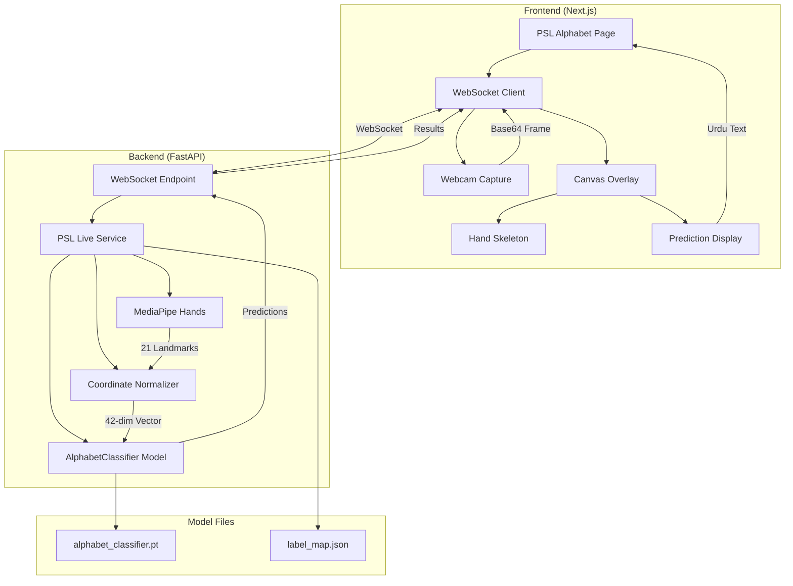
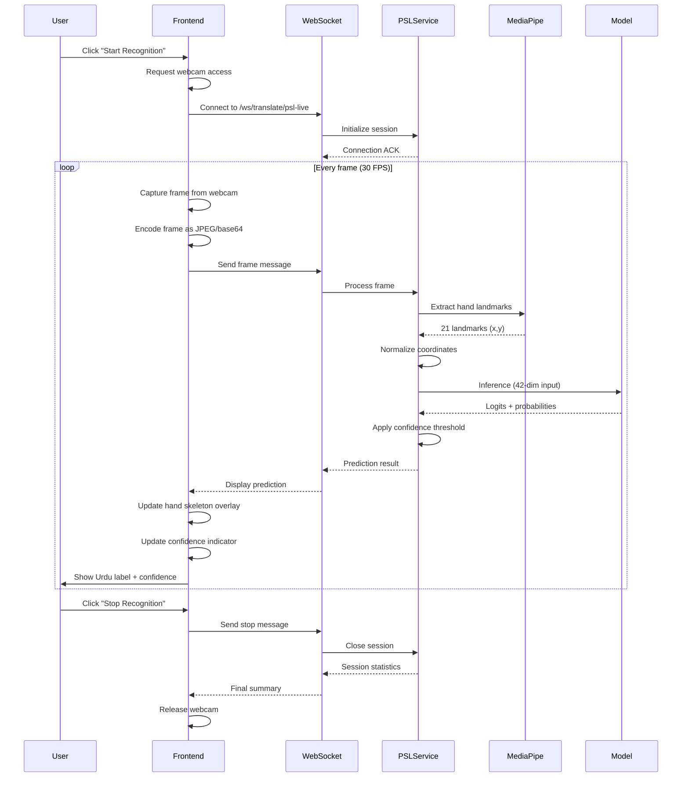
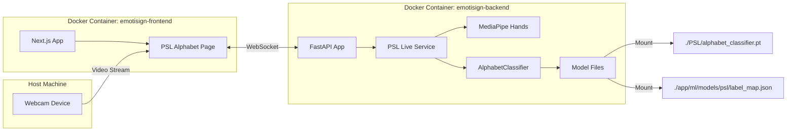
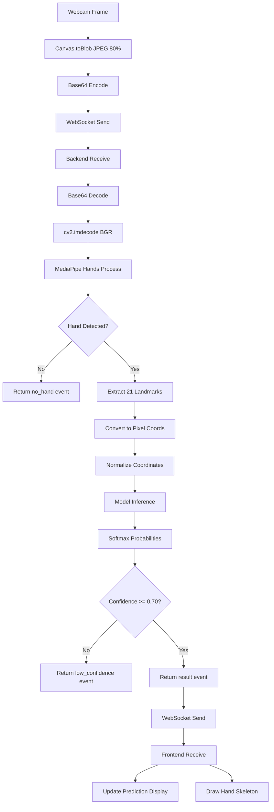

# Design Document: PSL Live Webcam Inference Integration

## Overview

This document specifies the technical design for integrating a real-time Pakistan Sign Language (PSL) alphabet recognition system into the EmotiSign application. The system enables live webcam-based inference using MediaPipe Hands for landmark detection and a feedforward neural network (AlphabetClassifier) for classification.

### Key Design Principles

1. **Real-time Performance**: WebSocket-based architecture for low-latency bidirectional communication
2. **Separation of Concerns**: Dedicated PSL live service separate from existing video upload services
3. **Model Consistency**: Use the same AlphabetClassifier model (42-dim input) from PSL/model.py
4. **Coordinate Normalization**: Apply identical preprocessing as PSL/preprocessor.py for inference accuracy
5. **User Experience**: Visual feedback with hand skeleton overlay, confidence indicators, and RTL Urdu text rendering

### System Context

The PSL live inference system integrates with:
- **Existing Backend**: FastAPI-based emotisign-backend with ML services
- **Existing Frontend**: Next.js emotisign-frontend with translation pages
- **Reference Implementation**: PSL/demo.py provides the real-time inference pattern
- **Model Architecture**: PSL/model.py defines the AlphabetClassifier (42 → 128 → 64 → num_classes)

### Scope

**In Scope**:
- New PSL live service with WebSocket endpoint
- MediaPipe Hands integration for landmark detection
- Coordinate normalization matching PSL/preprocessor.py
- New frontend page at `/translate/psl-alphabet`
- Hand skeleton visualization
- Real-time prediction display with confidence indicators
- Urdu text rendering with RTL support

**Out of Scope**:
- Video upload functionality (handled by existing services)
- Multi-hand detection (single hand only)
- GPU acceleration (CPU-only deployment)
- Model retraining or fine-tuning
- Authentication/authorization (guest access allowed)

## Architecture

### High-Level Architecture



### Component Interaction Flow



### Deployment Architecture



## Components and Interfaces

### Backend Components

#### 1. PSL Live Service (`emotisign-backend/app/ml/psl_live_service.py`)

**Purpose**: Core service for real-time PSL alphabet recognition using MediaPipe Hands and AlphabetClassifier.

**Responsibilities**:
- Load AlphabetClassifier model from checkpoint
- Initialize MediaPipe Hands for landmark detection
- Extract and normalize hand coordinates
- Perform inference with confidence filtering
- Manage session statistics

**Class Structure**:

```python
class PSLLiveService:
    """Service for real-time PSL alphabet recognition."""
    
    def __init__(
        self,
        model_path: str,
        label_map_path: str,
        device: str = "cpu",
        confidence_threshold: float = 0.70
    ):
        """Initialize PSL live service with model and configuration."""
        
    async def load_model(self) -> None:
        """Load AlphabetClassifier model and label map from checkpoint."""
        
    def extract_hand_landmarks(self, frame: np.ndarray) -> Optional[np.ndarray]:
        """
        Extract 21 hand landmarks from BGR frame using MediaPipe Hands.
        
        Args:
            frame: BGR image as numpy array
            
        Returns:
            42-dim array of normalized coordinates, or None if no hand detected
        """
        
    def normalize_coordinates(self, coords: np.ndarray) -> np.ndarray:
        """
        Apply translation and scale invariant normalization.
        
        Matches PSL/preprocessor.py:normalize_hand_coords() exactly.
        
        Args:
            coords: Raw 42-dim coordinate array (21 landmarks × 2)
            
        Returns:
            Normalized 42-dim array
        """
        
    async def predict(self, frame: np.ndarray) -> Dict:
        """
        Process single frame and return prediction.
        
        Args:
            frame: BGR image as numpy array
            
        Returns:
            {
                "event": "result" | "no_hand" | "low_confidence",
                "predicted_label": str,  # English label
                "urdu_text": str,        # Urdu character
                "confidence": float,     # 0.0 to 1.0
                "timestamp": float       # Unix timestamp
            }
        """
        
    def get_session_stats(self) -> Dict:
        """Return session statistics for logging."""
```

**Dependencies**:
- `torch`: Model inference
- `mediapipe`: Hand landmark detection
- `numpy`: Array operations
- `cv2`: Image processing

**Configuration**:
- Model path: `app/ml/models/psl/alphabet_classifier.pt`
- Label map path: `app/ml/models/psl/label_map.json`
- Confidence threshold: 0.70 (configurable)
- MediaPipe settings: `max_num_hands=1`, `min_detection_confidence=0.5`

---

#### 2. WebSocket Endpoint (`emotisign-backend/app/routers/ml.py`)

**Purpose**: WebSocket endpoint for bidirectional real-time communication.

**Endpoint**: `/ws/translate/psl-live`

**Connection Flow**:
1. Client connects to WebSocket
2. Server sends connection acknowledgment
3. Client sends frame messages
4. Server responds with prediction results
5. Client sends stop message
6. Server sends session statistics and closes

**Message Protocol**:

**Client → Server Messages**:

```typescript
// Frame message
{
  type: "frame",
  data: string,  // base64-encoded JPEG
  mime: "image/jpeg"
}

// Configuration message
{
  type: "config",
  confidence_threshold: number  // 0.0 to 1.0
}

// Stop message
{
  type: "stop"
}

// Ping message
{
  type: "ping"
}
```

**Server → Client Messages**:

```typescript
// Connection acknowledgment
{
  event: "connected",
  message: "PSL live inference session started",
  timestamp: number
}

// Prediction result
{
  event: "result",
  data: {
    predicted_label: string,    // English label
    urdu_text: string,          // Urdu character
    confidence: number,         // 0.0 to 1.0
    landmarks: number[][]       // [[x,y], ...] for visualization
  },
  timestamp: number
}

// No hand detected
{
  event: "no_hand",
  message: "No hand detected in frame",
  timestamp: number
}

// Low confidence
{
  event: "low_confidence",
  data: {
    predicted_label: string,
    confidence: number
  },
  timestamp: number
}

// Error
{
  event: "error",
  message: string,
  timestamp: number
}

// Session statistics
{
  event: "session_end",
  data: {
    total_frames: number,
    frames_with_hands: number,
    predictions_made: number,
    average_confidence: number,
    session_duration_seconds: number
  },
  timestamp: number
}

// Pong response
{
  event: "pong",
  timestamp: number
}
```

**Implementation**:

```python
@router.websocket("/ws/translate/psl-live")
async def psl_live_websocket(websocket: WebSocket):
    """WebSocket endpoint for real-time PSL alphabet recognition."""
    await websocket.accept()
    
    # Initialize service
    service = await get_psl_live_service()
    
    # Send connection acknowledgment
    await websocket.send_json({
        "event": "connected",
        "message": "PSL live inference session started",
        "timestamp": time.time()
    })
    
    session_start = time.time()
    total_frames = 0
    
    try:
        while True:
            # Receive message from client
            message = await websocket.receive_json()
            msg_type = message.get("type")
            
            if msg_type == "frame":
                total_frames += 1
                # Decode base64 frame
                frame_data = base64.b64decode(message["data"])
                frame = cv2.imdecode(
                    np.frombuffer(frame_data, np.uint8),
                    cv2.IMREAD_COLOR
                )
                
                # Process frame
                result = await service.predict(frame)
                await websocket.send_json(result)
                
            elif msg_type == "config":
                # Update configuration
                service.confidence_threshold = message.get("confidence_threshold", 0.70)
                
            elif msg_type == "stop":
                # Send session statistics
                stats = service.get_session_stats()
                stats["session_duration_seconds"] = time.time() - session_start
                await websocket.send_json({
                    "event": "session_end",
                    "data": stats,
                    "timestamp": time.time()
                })
                break
                
            elif msg_type == "ping":
                await websocket.send_json({
                    "event": "pong",
                    "timestamp": time.time()
                })
                
    except WebSocketDisconnect:
        logger.info(f"PSL live session ended: {total_frames} frames processed")
    except Exception as e:
        logger.error(f"PSL live session error: {e}")
        await websocket.send_json({
            "event": "error",
            "message": str(e),
            "timestamp": time.time()
        })
    finally:
        await websocket.close()
```

---

### Frontend Components

#### 1. PSL Alphabet Page (`emotisign-frontend/src/app/translate/psl-alphabet/page.tsx`)

**Purpose**: Dedicated page for PSL alphabet recognition with live webcam inference.

**Route**: `/translate/psl-alphabet`

**Component Structure**:

```typescript
export default function PSLAlphabetPage() {
  // State management
  const [isConnected, setIsConnected] = useState(false);
  const [isRecognizing, setIsRecognizing] = useState(false);
  const [prediction, setPrediction] = useState<PredictionResult | null>(null);
  const [fps, setFps] = useState(0);
  const [sessionStats, setSessionStats] = useState<SessionStats | null>(null);
  
  // Refs
  const videoRef = useRef<HTMLVideoElement>(null);
  const canvasRef = useRef<HTMLCanvasElement>(null);
  const wsRef = useRef<WebSocket | null>(null);
  const streamRef = useRef<MediaStream | null>(null);
  
  // WebSocket connection
  const connectWebSocket = () => { /* ... */ };
  const disconnectWebSocket = () => { /* ... */ };
  
  // Webcam management
  const startWebcam = async () => { /* ... */ };
  const stopWebcam = () => { /* ... */ };
  
  // Frame capture and transmission
  const captureAndSendFrame = () => { /* ... */ };
  
  // Hand skeleton visualization
  const drawHandSkeleton = (landmarks: number[][]) => { /* ... */ };
  
  // UI rendering
  return (
    <div className="max-w-4xl mx-auto">
      {/* Page header */}
      {/* Webcam viewport with canvas overlay */}
      {/* Prediction display with Urdu text */}
      {/* Confidence indicator */}
      {/* FPS counter */}
      {/* Control buttons */}
      {/* Session statistics */}
    </div>
  );
}
```

**Key Features**:
- Webcam video display with canvas overlay
- Hand skeleton visualization using MediaPipe landmark connections
- Real-time prediction display with color-coded confidence
- Urdu text rendering with RTL direction
- FPS counter and performance metrics
- Session statistics display

---

#### 2. WebSocket Client Hook (`emotisign-frontend/src/hooks/usePSLWebSocket.ts`)

**Purpose**: Reusable hook for managing PSL WebSocket connection.

```typescript
interface UsePSLWebSocketOptions {
  onResult: (result: PredictionResult) => void;
  onNoHand: () => void;
  onError: (error: string) => void;
  onSessionEnd: (stats: SessionStats) => void;
}

export function usePSLWebSocket(options: UsePSLWebSocketOptions) {
  const [isConnected, setIsConnected] = useState(false);
  const wsRef = useRef<WebSocket | null>(null);
  
  const connect = useCallback(() => {
    const ws = new WebSocket(`${WS_URL}/ws/translate/psl-live`);
    
    ws.onopen = () => {
      setIsConnected(true);
    };
    
    ws.onmessage = (event) => {
      const message = JSON.parse(event.data);
      
      switch (message.event) {
        case "result":
          options.onResult(message.data);
          break;
        case "no_hand":
          options.onNoHand();
          break;
        case "error":
          options.onError(message.message);
          break;
        case "session_end":
          options.onSessionEnd(message.data);
          break;
      }
    };
    
    ws.onerror = () => {
      options.onError("WebSocket connection error");
    };
    
    ws.onclose = () => {
      setIsConnected(false);
    };
    
    wsRef.current = ws;
  }, [options]);
  
  const sendFrame = useCallback((frameData: string) => {
    if (wsRef.current?.readyState === WebSocket.OPEN) {
      wsRef.current.send(JSON.stringify({
        type: "frame",
        data: frameData,
        mime: "image/jpeg"
      }));
    }
  }, []);
  
  const disconnect = useCallback(() => {
    if (wsRef.current) {
      wsRef.current.send(JSON.stringify({ type: "stop" }));
      wsRef.current.close();
      wsRef.current = null;
    }
  }, []);
  
  return { isConnected, connect, sendFrame, disconnect };
}
```

---

#### 3. Hand Skeleton Visualizer (`emotisign-frontend/src/components/HandSkeleton.tsx`)

**Purpose**: Canvas-based component for drawing hand landmarks and connections.

```typescript
interface HandSkeletonProps {
  landmarks: number[][];  // [[x, y], ...]
  width: number;
  height: number;
}

export function HandSkeleton({ landmarks, width, height }: HandSkeletonProps) {
  const canvasRef = useRef<HTMLCanvasElement>(null);
  
  useEffect(() => {
    if (!canvasRef.current || !landmarks) return;
    
    const ctx = canvasRef.current.getContext('2d');
    if (!ctx) return;
    
    // Clear canvas
    ctx.clearRect(0, 0, width, height);
    
    // Draw connections (MediaPipe hand connections)
    const connections = [
      [0, 1], [1, 2], [2, 3], [3, 4],        // Thumb
      [0, 5], [5, 6], [6, 7], [7, 8],        // Index
      [0, 9], [9, 10], [10, 11], [11, 12],   // Middle
      [0, 13], [13, 14], [14, 15], [15, 16], // Ring
      [0, 17], [17, 18], [18, 19], [19, 20], // Pinky
      [5, 9], [9, 13], [13, 17]              // Palm
    ];
    
    ctx.strokeStyle = 'white';
    ctx.lineWidth = 2;
    
    connections.forEach(([start, end]) => {
      const [x1, y1] = landmarks[start];
      const [x2, y2] = landmarks[end];
      
      ctx.beginPath();
      ctx.moveTo(x1, y1);
      ctx.lineTo(x2, y2);
      ctx.stroke();
    });
    
    // Draw landmarks
    ctx.fillStyle = '#22c55e';
    landmarks.forEach(([x, y]) => {
      ctx.beginPath();
      ctx.arc(x, y, 4, 0, 2 * Math.PI);
      ctx.fill();
    });
  }, [landmarks, width, height]);
  
  return (
    <canvas
      ref={canvasRef}
      width={width}
      height={height}
      className="absolute inset-0 pointer-events-none"
    />
  );
}
```

---

## Data Models

### Model Checkpoint Structure

**File**: `app/ml/models/psl/alphabet_classifier.pt`

```python
{
    "model_state_dict": OrderedDict,  # PyTorch state dict
    "num_classes": int,               # Number of alphabet classes
    "label_map": Dict[int, str],      # Class index → English label
    "input_dim": int,                 # Should be 42
    "hidden_dim_1": int,              # Should be 128
    "hidden_dim_2": int,              # Should be 64
    "training_accuracy": float,       # Optional metadata
    "validation_accuracy": float      # Optional metadata
}
```

### Label Map Structure

**File**: `app/ml/models/psl/label_map.json`

```json
{
  "0": "ا",
  "1": "ب",
  "2": "پ",
  "3": "ت",
  "4": "ٹ",
  "5": "ث",
  "6": "ج",
  "7": "چ",
  "8": "ح",
  "9": "خ",
  "10": "د",
  "11": "ڈ",
  "12": "ذ",
  "13": "ر",
  "14": "ڑ",
  "15": "ز",
  "16": "ژ",
  "17": "س",
  "18": "ش",
  "19": "ص",
  "20": "ض",
  "21": "ط",
  "22": "ظ"
}
```

**Note**: The actual number of classes and labels will be determined by the trained model checkpoint.

### TypeScript Interfaces

```typescript
// Prediction result from backend
interface PredictionResult {
  predicted_label: string;    // English label
  urdu_text: string;          // Urdu character
  confidence: number;         // 0.0 to 1.0
  landmarks: number[][];      // [[x, y], ...] 21 landmarks
}

// Session statistics
interface SessionStats {
  total_frames: number;
  frames_with_hands: number;
  predictions_made: number;
  average_confidence: number;
  session_duration_seconds: number;
}

// WebSocket message types
type WSMessage = 
  | { event: "connected"; message: string; timestamp: number }
  | { event: "result"; data: PredictionResult; timestamp: number }
  | { event: "no_hand"; message: string; timestamp: number }
  | { event: "low_confidence"; data: { predicted_label: string; confidence: number }; timestamp: number }
  | { event: "error"; message: string; timestamp: number }
  | { event: "session_end"; data: SessionStats; timestamp: number }
  | { event: "pong"; timestamp: number };
```

---

## Data Flow

### Frame Processing Pipeline



---

## Migration Plan: Removing the Existing PSL Service

### Files to Delete

| File | Reason |
|------|--------|
| `emotisign-backend/app/ml/psl_service.py` | Old 110-dim MLP classifier — replaced by `psl_live_service.py` |

### Files to Modify

| File | Change |
|------|--------|
| `emotisign-backend/main.py` | Remove `get_psl_service` import and startup call; add `get_psl_live_service` startup |
| `emotisign-backend/app/routers/ml.py` | Remove `/api/ml/psl-sign-to-text` endpoint; add `/ws/translate/psl-live` WebSocket |
| `emotisign-frontend/src/app/translate/sign-to-text/page.tsx` | Remove PSL option from language selector; remove PSL-specific result rendering |
| `emotisign-frontend/src/types/index.ts` | Remove `'PSL'` from `SignLanguage` union type (or keep for future use) |

### Files to Create

| File | Purpose |
|------|---------|
| `emotisign-backend/app/ml/psl_live_service.py` | New live inference service using AlphabetClassifier |
| `emotisign-backend/app/ml/models/psl/label_map.json` | Urdu alphabet label map extracted from checkpoint |
| `emotisign-frontend/src/app/translate/psl-alphabet/page.tsx` | Dedicated PSL alphabet recognition page |
| `emotisign-frontend/src/hooks/usePSLWebSocket.ts` | WebSocket client hook |
| `emotisign-frontend/src/components/HandSkeleton.tsx` | Canvas hand skeleton component |

### Model File Placement

The `PSL/alphabet_classifier.pt` file must be copied to the backend model directory:

```
PSL/alphabet_classifier.pt
  → emotisign-backend/app/ml/models/psl/alphabet_classifier.pt
```

The label map is extracted from the checkpoint at startup and optionally cached as JSON:

```
emotisign-backend/app/ml/models/psl/label_map.json  (generated or manually created)
```

---

## Error Handling Strategy

### Backend Error Handling

| Scenario | Handling |
|----------|----------|
| Model file missing at startup | Log error, mark PSL service as unavailable, return 503 on WebSocket connect |
| Invalid base64 frame data | Send `error` event with message, continue session |
| MediaPipe initialization failure | Log error, raise RuntimeError during `load_model()` |
| Frame decode failure (corrupt JPEG) | Send `error` event, skip frame, continue |
| Model inference exception | Send `error` event, log traceback, continue session |
| WebSocket client disconnect | Catch `WebSocketDisconnect`, log session stats, clean up |
| Unexpected exception in loop | Send `error` event, close WebSocket gracefully |

### Frontend Error Handling

| Scenario | Handling |
|----------|----------|
| Webcam permission denied | Show toast + inline instructions to enable camera |
| Webcam already in use | Show toast with "camera in use" message |
| WebSocket connection refused | Show toast, offer retry button, display connection status |
| WebSocket connection lost | Auto-reconnect up to 3 times with 2s backoff, then show error |
| Frame capture failure | Skip frame silently, continue loop |
| Malformed server message | Log to console, ignore message |

---

## Performance Considerations

### Backend

- **MediaPipe Hands** is initialized once per service instance (not per frame) — reused across all frames in a session
- **Model inference** runs synchronously in the WebSocket handler; at ~1ms per frame on CPU this is acceptable
- **Frame skipping**: if the backend is slower than the client send rate, frames queue up in the WebSocket buffer. The backend processes them in order — no explicit frame dropping needed at this scale
- **Thread safety**: MediaPipe Hands is not thread-safe; each WebSocket connection gets its own service instance via `get_psl_live_service()` returning a new instance per session (not a singleton)

### Frontend

- **Frame capture interval**: `setInterval` at 33ms (≈30 FPS) using `requestAnimationFrame` fallback
- **Canvas rendering**: skeleton drawn on a transparent `<canvas>` overlaid on `<video>` — no video manipulation
- **FPS calculation**: exponential moving average updated every second to avoid jitter
- **Memory**: `URL.createObjectURL` not used — frames go directly to canvas → blob → base64

---

## Security Considerations

- WebSocket endpoint allows unauthenticated (guest) connections — no JWT required
- Frame data is base64-encoded JPEG; no executable content is accepted
- `cv2.imdecode` is used for frame decoding — safe against malformed input (returns `None`)
- No user data is persisted — session stats are logged server-side only and not stored in the database
- CORS is handled by the existing FastAPI middleware configuration

---

## Navigation Integration

The PSL alphabet page is linked from the existing translate section. The navigation entry is added to the sidebar/nav component:

```typescript
// In the translate navigation links
{
  href: '/translate/psl-alphabet',
  label: 'PSL Alphabet',
  icon: <FiType />,
  badge: '🇵🇰'
}
```

The existing sign-to-text page (`/translate/sign-to-text`) retains only ASL after the PSL option is removed.

---

## Testing Strategy

### Backend Unit Tests

| Test | Description |
|------|-------------|
| `test_normalize_coordinates` | Verify output matches `PSL/preprocessor.py:normalize_hand_coords()` for identical inputs |
| `test_normalize_degenerate` | All-zero input returns zero vector without exception |
| `test_model_inference_shape` | Model accepts (1, 42) tensor and returns (1, num_classes) logits |
| `test_model_inference_dummy` | Random input produces valid softmax probabilities summing to 1.0 |
| `test_frame_decode_valid` | Valid JPEG base64 decodes to correct numpy array shape |
| `test_frame_decode_invalid` | Corrupt base64 returns error event without crashing |

### Backend Integration Tests

| Test | Description |
|------|-------------|
| `test_websocket_connect` | Client connects and receives `connected` event |
| `test_websocket_frame_no_hand` | Blank frame returns `no_hand` event |
| `test_websocket_stop` | Stop message returns `session_end` with valid stats |
| `test_websocket_ping_pong` | Ping message returns `pong` event |
| `test_websocket_config` | Config message updates confidence threshold |

### Frontend Tests

| Test | Description |
|------|-------------|
| `test_hand_skeleton_render` | HandSkeleton renders 21 circles and correct connections on canvas |
| `test_confidence_color` | Confidence < 0.70 → orange, 0.70–0.84 → yellow, ≥ 0.85 → green |
| `test_urdu_rtl` | Prediction display has `dir="rtl"` attribute |
| `test_webcam_permission_error` | Denied permission shows error message |
| `test_websocket_reconnect` | Connection loss triggers up to 3 reconnect attempts |

### Correctness Properties (Property-Based Tests)

1. **Normalization invariance**: `normalize(coords + offset) == normalize(coords)` for any offset
2. **Scale invariance**: `normalize(coords * k) == normalize(coords)` for any k > 0
3. **Output range**: all normalized values are within `[-2, 2]`
4. **Probability sum**: softmax output always sums to 1.0 ± 1e-5
5. **Confidence threshold**: predictions with confidence < 0.70 never appear as `result` events
