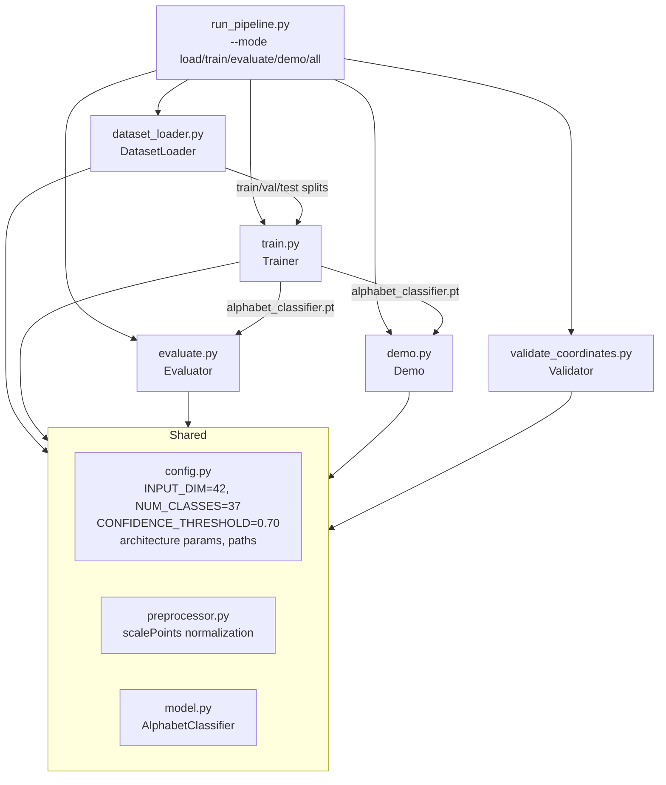
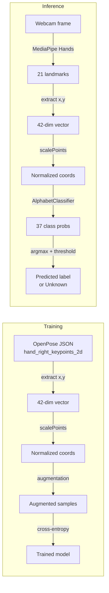

# Design Document: Right-Hand Alphabet Recognition System

## Overview

The Right-Hand Alphabet Recognition System is a Pakistan Sign Language (PSL) classifier for 37 Urdu alphabets using static right-hand poses. Unlike the existing 5-word temporal sequence system, this design uses single-frame classification with a simple feedforward neural network, trained on 5,112 samples from the rightHandDataset.

The system addresses three critical improvements over the current approach:

1. **7× more training data**: 5,112 alphabet samples vs. 706 word samples
2. **Eliminates pipeline mismatch**: Uses OpenPose JSON directly for training, MediaPipe for inference (both use the same 21-landmark hand model)
3. **Simpler architecture**: Static pose classification (42-dim input → feedforward NN → 37 classes) vs. temporal sequences (100×225 → Transformer → embedding space)

### Architecture Philosophy

**Why feedforward classification instead of metric learning?**  
With 5,112 samples across 37 classes (~138 samples/class), we have sufficient data for supervised learning. A standard cross-entropy classifier is simpler, faster to train, and easier to debug than triplet loss + nearest-neighbor search.

**Why static poses instead of temporal sequences?**  
PSL alphabets are static hand configurations, not gestures. Single-frame classification is the natural fit and eliminates the need for rolling buffers, sequence padding, and temporal modeling.

**Why 42 dimensions instead of 225?**  
Alphabets use only the right hand. Reducing from full-body keypoints (225 dims) to right-hand only (42 dims) cuts model size by 80% and improves training speed.

### Key Design Decisions

| Decision | Rationale |
|----------|-----------|
| Feedforward NN (42 → 128 → 64 → 37) | Simple, fast, sufficient for static poses |
| Cross-entropy loss | Standard supervised learning objective |
| Stratified 70/15/15 split | Ensures all classes represented in train/val/test |
| Confidence threshold 0.70 | Higher than word system (0.60) due to larger class count |
| MediaPipe for inference | Real-time hand tracking, same 21-landmark model as OpenPose |
| scalePoints normalization | Translation-invariant, scale-invariant (matches existing system) |

---

## Architecture



### Data Flow



---

## Components and Interfaces

### `config.py` — Shared Constants

Single source of truth for all hyperparameters, paths, and architecture parameters.

```python
# Dataset
DATASET_ROOT: str = "PSL_dataset/datasets/alphabets_dataset"
NUM_CLASSES: int = 37
INPUT_DIM: int = 42  # 21 landmarks × 2 coordinates

# Model architecture
HIDDEN_DIM_1: int = 128
HIDDEN_DIM_2: int = 64
DROPOUT: float = 0.3

# Training
TRAIN_SPLIT: float = 0.70
VAL_SPLIT: float = 0.15
TEST_SPLIT: float = 0.15
BATCH_SIZE: int = 32
LEARNING_RATE: float = 0.001
MAX_EPOCHS: int = 50
EARLY_STOPPING_PATIENCE: int = 10

# Augmentation
AUGMENT_NOISE_STD: float = 0.02
AUGMENT_ROTATION_DEG: float = 15.0
AUGMENT_SCALE_RANGE: tuple[float, float] = (0.9, 1.1)

# Inference
CONFIDENCE_THRESHOLD: float = 0.70

# Paths
MODEL_PATH: str = "alphabet_classifier.pt"
TRAINING_LOG_PATH: str = "training_log.csv"
EVAL_REPORT_PATH: str = "evaluation_report.txt"
CONFUSION_MATRIX_TXT: str = "confusion_matrix.txt"
CONFUSION_MATRIX_PNG: str = "confusion_matrix.png"
DATASET_STATS_PATH: str = "dataset_statistics.txt"
```

**Design rationale**: Higher confidence threshold (0.70 vs. 0.60) because 37 classes create more confusion opportunities than 5 classes. Dropout 0.3 provides regularization without over-constraining the model.

---

### `dataset_loader.py` — DatasetLoader

Recursively scans `alphabets_dataset/`, extracts right-hand coordinates from OpenPose JSON, and returns stratified train/val/test splits.

**Public interface:**

```python
def load_dataset(
    root_dir: str = DATASET_ROOT,
    train_split: float = TRAIN_SPLIT,
    val_split: float = VAL_SPLIT,
    test_split: float = TEST_SPLIT,
) -> tuple[
    tuple[np.ndarray, np.ndarray],  # (X_train, y_train)
    tuple[np.ndarray, np.ndarray],  # (X_val, y_val)
    tuple[np.ndarray, np.ndarray],  # (X_test, y_test)
    dict[int, str],                  # label_map: {0: '++', 1: '++ü', ...}
]:
    """Load and split dataset. Returns stratified splits and label mapping."""

def extract_right_hand_coords(json_path: Path) -> np.ndarray | None:
    """Extract hand_right_keypoints_2d from OpenPose JSON.
    Returns (42,) array of [x0, y0, x1, y1, ..., x20, y20] or None if invalid."""

def print_dataset_statistics(
    label_counts: dict[str, int],
    output_path: str = DATASET_STATS_PATH,
) -> None:
    """Print and save dataset statistics table."""
```

**Implementation details:**

1. **Directory traversal**: Use `Path(root_dir).rglob("*_keypoints.json")` to find all JSON files
2. **Label extraction**: `label = json_path.parent.parent.name` (e.g., `alphabets_dataset/++/1560784905.257021/file.json` → label is `++`)
3. **Coordinate extraction**:
   ```python
   data = json.load(f)
   if not data["people"]:
       return None
   hand_right = data["people"][0]["hand_right_keypoints_2d"]
   if len(hand_right) != 63:  # 21 landmarks × 3
       return None
   # Extract x, y (skip confidence)
   coords = np.array([hand_right[i:i+2] for i in range(0, 63, 3)]).flatten()
   if np.all(coords == 0):
       return None
   return coords  # shape (42,)
   ```
4. **Stratified split**: Use `sklearn.model_selection.train_test_split` with `stratify=y`
5. **Label encoding**: Map string labels to integers 0-36, save bidirectional mapping

**Validation checks:**

- Total samples between 5,000 and 5,200 (Requirement 1.6)
- Exactly 37 unique labels (Requirement 1.6)
- Warn if any class has < 100 samples (Requirement 8.3)

**Output format** (`dataset_statistics.txt`):

```
Dataset Statistics
==================
Total samples: 5112
Total classes: 37

Per-class counts:
  ++        : 138 samples
  ++ü       : 142 samples
  ...

Summary:
  Min: 120 samples
  Max: 150 samples
  Mean: 138.2 samples
  Std: 8.4 samples
```

---

### `preprocessor.py` — Preprocessor

Implements the scalePoints normalization algorithm: translate centroid to origin, scale by bounding box.

**Public interface:**

```python
def normalize_hand_coords(coords: np.ndarray) -> np.ndarray:
    """Apply scalePoints normalization to (42,) or (21, 2) array.
    Returns normalized coordinates of same shape."""
```

**Algorithm** (matches existing `scale.scalePoints`):

```python
def normalize_hand_coords(coords: np.ndarray) -> np.ndarray:
    # Reshape to (21, 2) if flat
    if coords.shape == (42,):
        coords = coords.reshape(21, 2)
    
    # Compute centroid
    centroid = coords.mean(axis=0)  # (2,)
    
    # Translate to origin
    translated = coords - centroid
    
    # Compute bounding box
    min_xy = translated.min(axis=0)
    max_xy = translated.max(axis=0)
    bbox_size = max_xy - min_xy  # (width, height)
    
    # Scale by max dimension
    max_dim = bbox_size.max()
    if max_dim == 0:
        # All points identical — return zeros
        return np.zeros_like(coords).flatten()
    
    scaled = translated / max_dim
    
    return scaled.flatten()  # (42,)
```

**Edge cases:**

- All landmarks identical → return zero vector (Requirement 2.3)
- Single outlier landmark → bounding box still computed correctly
- Negative coordinates → algorithm is translation-invariant

---

### `model.py` — AlphabetClassifier

Feedforward neural network for static pose classification.

**Public interface:**

```python
class AlphabetClassifier(nn.Module):
    def __init__(
        self,
        input_dim: int = INPUT_DIM,
        hidden_dim_1: int = HIDDEN_DIM_1,
        hidden_dim_2: int = HIDDEN_DIM_2,
        num_classes: int = NUM_CLASSES,
        dropout: float = DROPOUT,
    ):
        """Initialize feedforward classifier."""
    
    def forward(self, x: torch.Tensor) -> torch.Tensor:
        """Forward pass. Input: (batch, 42), Output: (batch, 37) logits."""
```

**Architecture:**

```python
class AlphabetClassifier(nn.Module):
    def __init__(self, input_dim=42, hidden_dim_1=128, hidden_dim_2=64, 
                 num_classes=37, dropout=0.3):
        super().__init__()
        self.fc1 = nn.Linear(input_dim, hidden_dim_1)
        self.bn1 = nn.BatchNorm1d(hidden_dim_1)
        self.dropout1 = nn.Dropout(dropout)
        
        self.fc2 = nn.Linear(hidden_dim_1, hidden_dim_2)
        self.bn2 = nn.BatchNorm1d(hidden_dim_2)
        self.dropout2 = nn.Dropout(dropout)
        
        self.fc3 = nn.Linear(hidden_dim_2, num_classes)
    
    def forward(self, x):
        x = F.relu(self.bn1(self.fc1(x)))
        x = self.dropout1(x)
        
        x = F.relu(self.bn2(self.fc2(x)))
        x = self.dropout2(x)
        
        x = self.fc3(x)  # logits (no softmax — handled by loss)
        return x
```

**Parameter count**: ~8K parameters (42×128 + 128×64 + 64×37 ≈ 5,376 + 8,192 + 2,368 = 15,936 weights + biases)

**Design rationale**:
- BatchNorm after each linear layer for training stability
- ReLU activation (standard choice for feedforward nets)
- Dropout after each hidden layer for regularization
- No softmax in forward pass (CrossEntropyLoss applies log_softmax internally)

---

### `train.py` — Trainer

Training loop with data augmentation, early stopping, and logging.

**Public interface:**

```python
def augment_coords(coords: np.ndarray) -> np.ndarray:
    """Apply random augmentation to normalized (42,) coordinates.
    Applies 2-4 transforms randomly selected from: noise, rotation, scaling, mirroring."""

def train(
    model: AlphabetClassifier,
    train_data: tuple[np.ndarray, np.ndarray],
    val_data: tuple[np.ndarray, np.ndarray],
    epochs: int = MAX_EPOCHS,
    batch_size: int = BATCH_SIZE,
    lr: float = LEARNING_RATE,
    patience: int = EARLY_STOPPING_PATIENCE,
) -> None:
    """Full training loop. Saves model and training_log.csv."""
```

**Augmentation transforms** (applied to training set only):

| Transform | Implementation | Probability |
|-----------|---------------|-------------|
| Gaussian noise | `coords + np.random.normal(0, 0.02, 42)` | 0.5 |
| Rotation | Apply 2D rotation matrix to (x, y) pairs, angle ~ Uniform(-15°, +15°) | 0.5 |
| Scaling | Multiply all coords by factor ~ Uniform(0.9, 1.1) | 0.5 |
| Horizontal mirror | Negate all x-coordinates (even indices) | 0.5 |

**Augmentation strategy**: Each training sample is augmented on-the-fly during each epoch. For each sample, 2-4 transforms are randomly selected and applied in sequence.

**Training loop**:

```python
optimizer = torch.optim.Adam(model.parameters(), lr=lr)
criterion = nn.CrossEntropyLoss()
best_val_loss = float('inf')
patience_counter = 0

for epoch in range(epochs):
    # Training phase
    model.train()
    for batch_X, batch_y in train_loader:
        # Apply augmentation to batch_X
        batch_X_aug = torch.stack([
            torch.from_numpy(augment_coords(x.numpy())) 
            for x in batch_X
        ])
        
        optimizer.zero_grad()
        logits = model(batch_X_aug)
        loss = criterion(logits, batch_y)
        loss.backward()
        optimizer.step()
    
    # Validation phase
    model.eval()
    with torch.no_grad():
        val_logits = model(val_X)
        val_loss = criterion(val_logits, val_y)
        val_acc = (val_logits.argmax(dim=1) == val_y).float().mean()
    
    # Log to CSV
    log_epoch(epoch, train_loss, val_loss, val_acc)
    
    # Early stopping
    if val_loss < best_val_loss:
        best_val_loss = val_loss
        torch.save(model.state_dict(), MODEL_PATH)
        patience_counter = 0
    else:
        patience_counter += 1
        if patience_counter >= patience:
            print(f"Early stopping at epoch {epoch}")
            break

# Restore best weights
model.load_state_dict(torch.load(MODEL_PATH))
```

**Training log format** (`training_log.csv`):

```csv
epoch,train_loss,val_loss,val_accuracy
1,3.2145,2.8934,0.2456
2,2.7821,2.5123,0.3789
...
```

---

### `evaluate.py` — Evaluator

Computes test set metrics, confusion matrix, and per-class statistics.

**Public interface:**

```python
def evaluate_model(
    model: AlphabetClassifier,
    test_data: tuple[np.ndarray, np.ndarray],
    label_map: dict[int, str],
) -> dict:
    """Evaluate on test set. Returns metrics dict."""

def save_confusion_matrix(
    cm: np.ndarray,
    labels: list[str],
    txt_path: str = CONFUSION_MATRIX_TXT,
    png_path: str = CONFUSION_MATRIX_PNG,
) -> None:
    """Save confusion matrix as text and heatmap image."""

def save_evaluation_report(
    metrics: dict,
    report_path: str = EVAL_REPORT_PATH,
) -> None:
    """Save evaluation_report.txt with all metrics."""
```

**Metrics computed**:

- Overall accuracy
- Per-class precision, recall, F1-score (using `sklearn.metrics.classification_report`)
- 37×37 confusion matrix
- Top 5 most-confused alphabet pairs (highest off-diagonal values in confusion matrix)

**Evaluation report format** (`evaluation_report.txt`):

```
Right-Hand Alphabet Recognition — Test Set Evaluation
======================================================
Overall Accuracy: 0.XXXX
Test samples: N

Per-class Metrics:
  Label  Precision  Recall  F1-Score  Support
  ++     0.XX       0.XX    0.XX      N
  ++ü    0.XX       0.XX    0.XX      N
  ...

Top 5 Most-Confused Pairs:
  1. ++ ↔ ++ü : 12 confusions
  2. ...

[WARNING: test accuracy below 80% — consider collecting more data or tuning hyperparameters.]
```

**Confusion matrix heatmap**: Use `matplotlib` + `seaborn` to generate a 37×37 heatmap with:
- Colormap: `Blues`
- Annotations: cell values
- Axis labels: alphabet labels (rotated 90° for readability)
- Title: "Confusion Matrix — Test Set"

---

### `demo.py` — Real-Time Webcam Demo

Live inference with MediaPipe hand tracking and on-screen overlay.

**Public interface:**

```python
def run_demo(
    model_path: str = MODEL_PATH,
    camera_index: int = 0,
    threshold: float = CONFIDENCE_THRESHOLD,
) -> None:
    """Open webcam, run real-time inference, display overlay. Exit on 'q'."""
```

**MediaPipe integration**:

```python
import mediapipe as mp

mp_hands = mp.solutions.hands
hands = mp_hands.Hands(
    static_image_mode=False,
    max_num_hands=1,
    min_detection_confidence=0.5,
    min_tracking_confidence=0.5,
)

# Process frame
results = hands.process(cv2.cvtColor(frame, cv2.COLOR_BGR2RGB))

if results.multi_hand_landmarks:
    # Extract right hand (check handedness)
    for idx, hand_landmarks in enumerate(results.multi_hand_landmarks):
        handedness = results.multi_handedness[idx].classification[0].label
        if handedness == "Right":
            # Extract 21 landmarks in pixel coordinates
            h, w, _ = frame.shape
            coords = np.array([
                [lm.x * w, lm.y * h] 
                for lm in hand_landmarks.landmark
            ]).flatten()  # (42,)
            
            # Normalize and classify
            normalized = normalize_hand_coords(coords)
            logits = model(torch.from_numpy(normalized).float().unsqueeze(0))
            probs = F.softmax(logits, dim=1).squeeze()
            confidence, pred_idx = probs.max(dim=0)
            
            if confidence >= threshold:
                label = label_map[pred_idx.item()]
            else:
                label = "Unknown"
```

**Overlay elements** (drawn with `cv2.putText` and `cv2.rectangle`):

| Element | Position | Content |
|---------|----------|---------|
| Predicted label | (10, 40) | `f"Sign: {label}"` (font size 1.2, green if confident, yellow if Unknown) |
| Confidence score | (10, 80) | `f"Conf: {confidence:.2f}"` |
| Confidence bar | (10, 100) to (310, 120) | Horizontal bar, width = `confidence * 300`, green if ≥ threshold, red otherwise |
| Threshold line | (10 + threshold*300, 100) to (10 + threshold*300, 120) | Vertical red line on confidence bar |
| No hand message | Center of frame | `"No hand detected"` (gray text) |
| FPS counter | Top-right (w-100, 40) | `f"FPS: {fps:.1f}"` |

**Performance optimization**:
- Process every frame (no skipping)
- Use MediaPipe's tracking mode (`static_image_mode=False`) for speed
- Target: 20 FPS on CPU (MediaPipe hand tracking is ~30-40 ms/frame, model inference is ~2 ms)

**Error handling**:

```python
cap = cv2.VideoCapture(camera_index)
if not cap.isOpened():
    print("Error: cannot open webcam")
    sys.exit(1)

# Main loop
while True:
    ret, frame = cap.read()
    if not ret:
        print("Error: failed to read frame")
        break
    
    # ... process frame ...
    
    cv2.imshow("PSL Alphabet Recognition", frame)
    if cv2.waitKey(1) & 0xFF == ord('q'):
        break

cap.release()
cv2.destroyAllWindows()
```

---

### `validate_coordinates.py` — Coordinate Validator

Verifies MediaPipe and OpenPose produce compatible normalized coordinates.

**Public interface:**

```python
def validate_coordinate_compatibility(
    sample_json_path: str,
    tolerance: float = 1e-3,
) -> bool:
    """Load OpenPose JSON, extract coords, normalize, then simulate MediaPipe
    extraction and verify normalized outputs match within tolerance."""
```

**Validation algorithm**:

```python
def validate_coordinate_compatibility(sample_json_path, tolerance=1e-3):
    # 1. Load OpenPose JSON and extract right hand
    openpose_coords = extract_right_hand_coords(Path(sample_json_path))
    if openpose_coords is None:
        print("ERROR: Invalid OpenPose JSON")
        return False
    
    # 2. Normalize OpenPose coords
    openpose_normalized = normalize_hand_coords(openpose_coords)
    
    # 3. Simulate MediaPipe extraction (same raw coords)
    # MediaPipe returns landmarks in normalized [0, 1] coordinates
    # Convert to pixel coords assuming 640×480 frame
    W, H = 640, 480
    mediapipe_coords = openpose_coords.copy()
    # (In real usage, MediaPipe coords are already in pixels after multiplying by frame size)
    
    # 4. Normalize MediaPipe coords
    mediapipe_normalized = normalize_hand_coords(mediapipe_coords)
    
    # 5. Compare
    diff = np.abs(openpose_normalized - mediapipe_normalized)
    max_diff = diff.max()
    
    if max_diff > tolerance:
        print(f"ERROR: Coordinate mismatch, max diff = {max_diff:.6f}")
        print(f"Mismatched indices: {np.where(diff > tolerance)[0]}")
        return False
    
    print(f"✓ Coordinate validation passed (max diff = {max_diff:.6f})")
    return True
```

**Usage**: Run once during setup to verify the pipeline is correct. Not part of the main training/inference flow.

---

### `run_pipeline.py` — Unified Entry Point

```python
def main():
    parser = argparse.ArgumentParser(description="PSL Alphabet Recognition Pipeline")
    parser.add_argument(
        "--mode",
        choices=["load", "train", "evaluate", "demo", "all"],
        required=True,
        help="Pipeline mode",
    )
    parser.add_argument(
        "--threshold",
        type=float,
        default=CONFIDENCE_THRESHOLD,
        help="Confidence threshold for demo mode",
    )
    args = parser.parse_args()
    
    # Dispatch
    if args.mode == "load":
        run_load()
    elif args.mode == "train":
        run_train()
    elif args.mode == "evaluate":
        run_evaluate()
    elif args.mode == "demo":
        run_demo_mode(args.threshold)
    elif args.mode == "all":
        run_all()
```

**Mode dispatch table**:

| `--mode` | Steps executed | Timing |
|----------|---------------|--------|
| `load` | Load dataset, print statistics, save to `dataset_statistics.txt` | ✓ |
| `train` | Load dataset → train model → save `alphabet_classifier.pt` and `training_log.csv` | ✓ |
| `evaluate` | Load model → evaluate on test set → save reports and confusion matrix | ✓ |
| `demo` | Check model exists → run webcam demo with `--threshold` | ✗ |
| `all` | load → train → evaluate → demo (with timing for each step) | ✓ |

**Timing implementation** (for `--mode all`):

```python
def run_all():
    steps = [
        ("Loading dataset", run_load),
        ("Training model", run_train),
        ("Evaluating model", run_evaluate),
        ("Running demo", lambda: run_demo_mode(CONFIDENCE_THRESHOLD)),
    ]
    
    total_start = time.time()
    for step_name, step_fn in steps:
        print(f"\n{'='*60}")
        print(f"Starting: {step_name}")
        print(f"{'='*60}")
        step_start = time.time()
        
        step_fn()
        
        step_elapsed = time.time() - step_start
        print(f"\n✓ {step_name} completed in {step_elapsed:.1f}s")
    
    total_elapsed = time.time() - total_start
    print(f"\n{'='*60}")
    print(f"Total pipeline time: {total_elapsed:.1f}s")
    print(f"{'='*60}")
```

**Model existence check** (for `--mode demo`):

```python
def run_demo_mode(threshold):
    if not Path(MODEL_PATH).exists():
        print("Model not found — run with --mode train first")
        sys.exit(1)
    run_demo(threshold=threshold)
```

---

## Data Models

### Right-Hand Coordinates (Raw)

```
shape: (42,) or (21, 2)
dtype: float32
layout: [x0, y0, x1, y1, ..., x20, y20]
units: pixels (both OpenPose and MediaPipe after conversion)
```

**OpenPose format**: `hand_right_keypoints_2d` is a flat array of 63 values: `[x0, y0, c0, x1, y1, c1, ..., x20, y20, c20]` where `c` is confidence. We extract only `(x, y)` pairs.

**MediaPipe format**: `hand_landmarks.landmark` is a list of 21 `NormalizedLandmark` objects with `.x`, `.y`, `.z` in [0, 1]. We convert to pixels: `(x * frame_width, y * frame_height)`.

### Normalized Coordinates

```
shape: (42,)
dtype: float32
range: typically [-0.5, 0.5] after scalePoints normalization
properties: translation-invariant, scale-invariant
```

### Label Encoding

```python
label_map: dict[int, str]  # {0: '++', 1: '++ü', ..., 36: 'ے'}
inverse_map: dict[str, int]  # {'++': 0, '++ü': 1, ..., 'ے': 36}
```

Alphabetical ordering of folder names determines integer encoding.

### Model Input/Output

**Input**:
```
shape: (batch_size, 42)
dtype: torch.float32
```

**Output (logits)**:
```
shape: (batch_size, 37)
dtype: torch.float32
interpretation: unnormalized log-probabilities (apply softmax for probabilities)
```

### Dataset Splits

```python
X_train: np.ndarray  # shape (N_train, 42)
y_train: np.ndarray  # shape (N_train,), dtype int64, values in [0, 36]

X_val: np.ndarray    # shape (N_val, 42)
y_val: np.ndarray    # shape (N_val,)

X_test: np.ndarray   # shape (N_test, 42)
y_test: np.ndarray   # shape (N_test,)
```

Expected sizes (for 5,112 total samples):
- Train: ~3,578 samples (70%)
- Val: ~767 samples (15%)
- Test: ~767 samples (15%)

### Training Log

```csv
epoch,train_loss,val_loss,val_accuracy
1,3.2145,2.8934,0.2456
2,2.7821,2.5123,0.3789
...
```

### Confusion Matrix

```
shape: (37, 37)
dtype: int
interpretation: cm[i, j] = number of samples with true label i predicted as label j
```

---

## Correctness Properties


*A property is a characteristic or behavior that should hold true across all valid executions of a system — essentially, a formal statement about what the system should do. Properties serve as the bridge between human-readable specifications and machine-verifiable correctness guarantees.*

### Property Reflection

After analyzing all acceptance criteria, I identified the following property-testable requirements. Through reflection, I've consolidated redundant properties and focused on unique validation value:

**Consolidated Properties:**
- Requirements 1.2, 1.3, 1.4 all test coordinate extraction and parsing → combined into Property 1 (coordinate extraction pipeline)
- Requirements 2.1, 2.2 both test normalization algorithm → combined into Property 2 (normalization correctness)
- Requirements 2.4, 10.3 both test MediaPipe/OpenPose compatibility → combined into Property 3 (coordinate compatibility)
- Requirements 4.1, 4.2 both test dataset splitting → combined into Property 4 (stratified splitting)
- Requirements 5.1, 5.2 both test evaluation metrics → combined into Property 5 (evaluation correctness)
- Requirements 7.2, 6.4 both test confidence thresholding → combined into Property 6 (confidence threshold)

**Eliminated Redundancies:**
- Property "output shape is (batch, 37)" is subsumed by Property "softmax probabilities sum to 1" (if shape is wrong, softmax won't work)
- Property "augmentation preserves shape" is implied by Property "augmentation produces valid outputs"
- Property "label extraction from path" is a specific case of the general coordinate extraction pipeline

### Property 1: Coordinate Extraction Pipeline Correctness

*For any* valid OpenPose JSON file containing `hand_right_keypoints_2d` with 21 landmarks × 3 values (x, y, confidence), extracting the (x, y) pairs SHALL produce a 42-dimensional vector where element 2i contains the x-coordinate of landmark i and element 2i+1 contains the y-coordinate of landmark i.

**Validates: Requirements 1.2, 1.3, 1.4**

---

### Property 2: Normalization Translation and Scale Invariance

*For any* set of 21 (x, y) hand landmarks, applying the scalePoints normalization algorithm SHALL produce output that is invariant to translation (shifting all coordinates by a constant vector) and invariant to uniform scaling (multiplying all coordinates by a positive constant).

**Validates: Requirements 2.1, 2.2**

---

### Property 3: MediaPipe and OpenPose Coordinate Compatibility

*For any* set of raw hand coordinates, normalizing coordinates extracted from OpenPose JSON and normalizing the same coordinates extracted via MediaPipe (after pixel conversion) SHALL produce outputs that differ by at most 1e-3 in any dimension.

**Validates: Requirements 2.4, 2.5, 10.1, 10.3**

---

### Property 4: Stratified Dataset Splitting Preserves Class Distribution

*For any* multi-class dataset with N samples and C classes, applying stratified splitting with ratios (0.70, 0.15, 0.15) SHALL produce three splits where each class appears in proportions within ±5% of the target ratios, and the sum of split sizes equals N.

**Validates: Requirements 4.1, 4.2**

---

### Property 5: Softmax Output Probability Constraint

*For any* valid 42-dimensional input to the AlphabetClassifier, applying softmax to the output logits SHALL produce 37 probabilities that sum to 1.0 (within floating-point tolerance of 1e-5) and each probability is in the range [0, 1].

**Validates: Requirements 3.2**

---

### Property 6: Confidence Threshold Determines Unknown Classification

*For any* classifier output where the maximum softmax probability is below the Confidence_Threshold, the classification function SHALL return "Unknown" as the predicted label; and for any output where the maximum probability is at or above the threshold, the function SHALL return the corresponding alphabet label.

**Validates: Requirements 6.4, 7.2**

---

### Property 7: Data Augmentation Preserves Dimensionality

*For any* normalized 42-dimensional coordinate vector, applying any combination of augmentation transforms (Gaussian noise, rotation, scaling, horizontal mirroring) SHALL produce an output vector of exactly 42 dimensions.

**Validates: Requirements 4.3**

---

### Property 8: Early Stopping Triggers After Patience Epochs

*For any* training run where validation loss does not improve (decrease) for exactly P consecutive epochs (where P is the patience parameter), the training loop SHALL stop at epoch N+P (where N is the last epoch with improvement) and restore the model weights from epoch N.

**Validates: Requirements 4.5**

---

### Property 9: Confusion Matrix Dimensions and Symmetry

*For any* test set with predictions and ground truth labels from C classes, the generated confusion matrix SHALL have shape (C, C), the sum of all elements SHALL equal the number of test samples, and the sum of row i SHALL equal the number of samples with true label i.

**Validates: Requirements 5.2**

---

### Property 10: Dataset Statistics Computation Correctness

*For any* dataset with per-class sample counts, computing statistics (min, max, mean, standard deviation) SHALL produce values where min ≤ mean ≤ max, standard deviation ≥ 0, and mean equals the sum of counts divided by the number of classes.

**Validates: Requirements 8.2**

---

### Property 11: Command-Line Threshold Override

*For any* valid threshold value T in the range [0.0, 1.0] provided via the `--threshold` command-line argument, the demo mode SHALL use T as the confidence threshold instead of the default value, and predictions with confidence < T SHALL be classified as "Unknown".

**Validates: Requirements 7.4, 9.5**

---

### Property 12: Coordinate Validation Round-Trip

*For any* set of raw hand coordinates, the validation pipeline SHALL extract coordinates from OpenPose JSON, normalize them, then extract the same raw coordinates via simulated MediaPipe extraction, normalize them, and verify the two normalized outputs match within tolerance 1e-3.

**Validates: Requirements 10.3**

---

## Error Handling

### Webcam Unavailable (`demo.py`)

```python
cap = cv2.VideoCapture(camera_index)
if not cap.isOpened():
    print("Error: cannot open webcam")
    sys.exit(1)
```

### Model File Missing (`run_pipeline.py` demo mode)

```python
if not Path(MODEL_PATH).exists():
    print("Model not found — run with --mode train first")
    sys.exit(1)
```

### Invalid OpenPose JSON

If `people` array is empty or `hand_right_keypoints_2d` contains all zeros:
```python
if not data["people"] or np.all(coords == 0):
    logger.warning(f"Skipping invalid file: {json_path}")
    return None
```

### Degenerate Hand Pose (All Landmarks Identical)

If bounding box maximum dimension is zero during normalization:
```python
if max_dim == 0:
    logger.warning(f"Degenerate hand pose detected: all landmarks identical")
    return np.zeros(42, dtype=np.float32)
```

### No Right Hand Detected (MediaPipe)

```python
if not results.multi_hand_landmarks:
    cv2.putText(frame, "No hand detected", (w//2 - 100, h//2), 
                cv2.FONT_HERSHEY_SIMPLEX, 1.0, (128, 128, 128), 2)
    continue
```

### Wrong Hand Detected (Left Instead of Right)

```python
handedness = results.multi_handedness[idx].classification[0].label
if handedness != "Right":
    cv2.putText(frame, "Please use right hand", (10, 40), 
                cv2.FONT_HERSHEY_SIMPLEX, 1.0, (0, 0, 255), 2)
    continue
```

### JSON Parse Error

```python
try:
    with open(json_path) as f:
        data = json.load(f)
except json.JSONDecodeError as e:
    logger.error(f"Failed to parse {json_path}: {e}")
    return None
```

### Insufficient Samples Per Class

```python
if count < 100:
    logger.warning(f"WARNING: class {label} has only {count} samples — may cause training instability.")
```

### Low Test Accuracy

```python
if test_accuracy < 0.80:
    print("WARNING: test accuracy below 80% — consider collecting more data or tuning hyperparameters.")
```

### Invalid Threshold Argument

```python
if not (0.0 <= args.threshold <= 1.0):
    print(f"Error: --threshold must be in range [0.0, 1.0], got {args.threshold}")
    sys.exit(1)
```

---

## Testing Strategy

### Unit Tests

Focus on pure functions with deterministic behavior:

- `extract_right_hand_coords()`: verify correct extraction from valid JSON, verify None returned for invalid JSON
- `normalize_hand_coords()`: verify output shape is (42,), verify zero vector for degenerate input, verify translation invariance, verify scale invariance
- `augment_coords()`: verify output shape is (42,), verify augmentation parameters are within specified bounds
- `compute_statistics()`: verify min ≤ mean ≤ max, verify std ≥ 0, verify mean calculation
- `stratified_split()`: verify split sizes match target ratios, verify all samples are assigned to exactly one split
- `classify_with_threshold()`: verify "Unknown" returned when confidence < threshold, verify correct label returned when confidence ≥ threshold

### Property-Based Tests

Property-based testing is appropriate for this system because the core functions are pure transformations over numerical arrays with well-defined universal properties. The chosen library is **Hypothesis** (Python).

Each property test runs a minimum of 100 iterations.

**Tag format**: `# Feature: right-hand-alphabet-recognition, Property {N}: {property_text}`

- **Property 1** — Coordinate extraction: generate random valid OpenPose JSON structures, verify extraction produces 42-dim vectors with correct x,y ordering
- **Property 2** — Normalization invariance: generate random hand coordinates, apply random translations and scalings, verify normalized outputs are equivalent
- **Property 3** — Coordinate compatibility: generate random raw coordinates, normalize via both OpenPose and MediaPipe paths, verify outputs match within 1e-3
- **Property 4** — Stratified splitting: generate random multi-class datasets, apply splitting, verify class proportions are maintained within ±5%
- **Property 5** — Softmax constraint: generate random 42-dim inputs, pass through model, apply softmax, verify probabilities sum to 1.0 and are in [0, 1]
- **Property 6** — Confidence threshold: generate random classifier outputs with varying max probabilities, verify "Unknown" returned when max_prob < threshold
- **Property 7** — Augmentation dimensionality: generate random 42-dim vectors, apply random augmentation combinations, verify output shape is (42,)
- **Property 8** — Early stopping: simulate training with controlled validation losses, verify early stopping triggers at correct epoch
- **Property 9** — Confusion matrix: generate random predictions and ground truth, verify matrix dimensions, row sums, and total sum
- **Property 10** — Statistics computation: generate random class counts, verify min ≤ mean ≤ max and std ≥ 0
- **Property 11** — Threshold override: test with random threshold values in [0.0, 1.0], verify they are applied correctly
- **Property 12** — Validation round-trip: generate random coordinates, verify round-trip through both extraction paths produces matching normalized outputs

### Integration Tests

- Load actual `alphabets_dataset/`, verify 37 classes and 5,000-5,200 samples
- Train model for 5 epochs on small subset, verify `alphabet_classifier.pt` is created
- Load trained model, run inference on one sample, verify output shape is (37,)
- Run `run_pipeline.py --mode all` end-to-end, verify all output files are created
- Run `validate_coordinates.py` on actual OpenPose JSON sample, verify validation passes

### Manual / Smoke Tests

- `run_pipeline.py --mode demo`: verify webcam opens, hand detection works, predictions are displayed, 'q' closes cleanly
- `run_pipeline.py --mode demo --threshold 0.9`: verify higher threshold results in more "Unknown" predictions
- Test with left hand: verify "Please use right hand" message is displayed
- Test with no hand: verify "No hand detected" message is displayed
- Verify confusion matrix heatmap is readable with 37 labels

---

## Performance Considerations

### Training Performance

**Target**: Train on 5,112 samples for 50 epochs in < 30 minutes on CPU

**Optimizations**:
- Small model size (~16K parameters)
- Batch size 32 (balances memory and gradient noise)
- No GPU required (model is small enough for CPU)
- Data augmentation applied on-the-fly (no need to pre-generate augmented dataset)

**Expected training time**: ~20-25 minutes on modern CPU (Intel i5/i7 or equivalent)

### Inference Performance

**Target**: 20 FPS on CPU for real-time demo

**Bottlenecks**:
- MediaPipe hand detection: ~30-40 ms/frame (dominant cost)
- Model inference: ~2 ms/frame (negligible)
- Frame rendering: ~5 ms/frame

**Total budget**: ~50 ms/frame → 20 FPS ✓

**Optimizations**:
- Use MediaPipe tracking mode (`static_image_mode=False`) for speed
- Process every frame (no skipping needed)
- Minimal overlay rendering (text + bar only)

### Memory Usage

**Training**: ~500 MB (model + dataset + gradients)
**Inference**: ~100 MB (model + MediaPipe + frame buffer)

Both well within typical system constraints.

---

## Deployment Considerations

### Dependencies

```
python >= 3.8
torch >= 1.10
numpy >= 1.20
opencv-python >= 4.5
mediapipe >= 0.8
scikit-learn >= 1.0
matplotlib >= 3.3
seaborn >= 0.11
```

### File Structure

```
project_root/
├── config.py
├── dataset_loader.py
├── preprocessor.py
├── model.py
├── train.py
├── evaluate.py
├── demo.py
├── validate_coordinates.py
├── run_pipeline.py
├── PSL_dataset/
│   └── datasets/
│       └── alphabets_dataset/
│           ├── ++/
│           ├── ++ü/
│           └── ... (37 alphabet folders)
├── alphabet_classifier.pt (generated)
├── training_log.csv (generated)
├── evaluation_report.txt (generated)
├── confusion_matrix.txt (generated)
├── confusion_matrix.png (generated)
└── dataset_statistics.txt (generated)
```

### Running the System

**Full pipeline**:
```bash
python run_pipeline.py --mode all
```

**Individual steps**:
```bash
python run_pipeline.py --mode load      # Load and validate dataset
python run_pipeline.py --mode train     # Train model
python run_pipeline.py --mode evaluate  # Evaluate on test set
python run_pipeline.py --mode demo      # Run webcam demo
```

**Custom threshold**:
```bash
python run_pipeline.py --mode demo --threshold 0.85
```

**Coordinate validation**:
```bash
python validate_coordinates.py
```

---

## Future Enhancements

### Potential Improvements

1. **Temporal smoothing**: Average predictions over 3-5 frames to reduce jitter
2. **Both hands**: Extend to support both right and left hand alphabets
3. **Word formation**: Combine alphabet predictions into words with spell-checking
4. **Model compression**: Quantize model to int8 for faster inference
5. **Mobile deployment**: Port to TensorFlow Lite for Android/iOS
6. **Data collection tool**: Build UI for collecting new alphabet samples
7. **Active learning**: Identify low-confidence predictions for manual labeling
8. **Multi-person support**: Handle multiple hands in frame simultaneously

### Known Limitations

1. **Static poses only**: Cannot recognize dynamic gestures or motion-based signs
2. **Right hand only**: Left hand alphabets not supported
3. **Single hand**: Cannot handle two-handed alphabets
4. **Lighting sensitivity**: Performance may degrade in poor lighting conditions
5. **Background clutter**: Complex backgrounds may interfere with hand detection
6. **Occlusion**: Partially occluded hands may not be detected correctly
7. **Dataset bias**: Model trained on specific signers may not generalize to all users

---

## Appendix: Coordinate System Details

### OpenPose Hand Landmark Order

```
0: Wrist
1-4: Thumb (base to tip)
5-8: Index finger (base to tip)
9-12: Middle finger (base to tip)
13-16: Ring finger (base to tip)
17-20: Pinky finger (base to tip)
```

### MediaPipe Hand Landmark Order

MediaPipe uses the same 21-landmark model as OpenPose with identical ordering.

### Coordinate Conversion

**OpenPose JSON**: `hand_right_keypoints_2d` is a flat array of 63 values: `[x0, y0, c0, x1, y1, c1, ..., x20, y20, c20]`

**Extraction**: `coords = [hand_right[i:i+2] for i in range(0, 63, 3)]` → 21 (x, y) pairs → flatten to 42-dim vector

**MediaPipe**: `landmark` objects have `.x`, `.y`, `.z` in normalized [0, 1] coordinates

**Conversion**: `x_pixel = landmark.x * frame_width`, `y_pixel = landmark.y * frame_height`

### Normalization Algorithm (scalePoints)

```python
def scalePoints(coords):
    # Input: (21, 2) array of (x, y) coordinates
    # Output: (21, 2) array of normalized coordinates
    
    # 1. Compute centroid
    centroid = coords.mean(axis=0)  # (2,)
    
    # 2. Translate to origin
    translated = coords - centroid
    
    # 3. Compute bounding box
    min_xy = translated.min(axis=0)
    max_xy = translated.max(axis=0)
    bbox = max_xy - min_xy  # (width, height)
    
    # 4. Scale by max dimension
    max_dim = bbox.max()
    if max_dim == 0:
        return np.zeros_like(coords)
    
    scaled = translated / max_dim
    
    return scaled
```

**Properties**:
- Translation-invariant: `scalePoints(coords + offset) == scalePoints(coords)`
- Scale-invariant: `scalePoints(coords * scale) == scalePoints(coords)` for scale > 0
- Rotation-variant: `scalePoints(rotate(coords)) != scalePoints(coords)` (intentional — preserves hand orientation)

---

## References

1. OpenPose Hand Keypoint Format: https://github.com/CMU-Perceptual-Computing-Lab/openpose/blob/master/doc/02_output.md
2. MediaPipe Hands: https://google.github.io/mediapipe/solutions/hands.html
3. Pakistan Sign Language Dataset: PSL_dataset/datasets/alphabets_dataset/
4. Existing PSL Demo System: `.kiro/specs/psl-demo-system/design.md`
