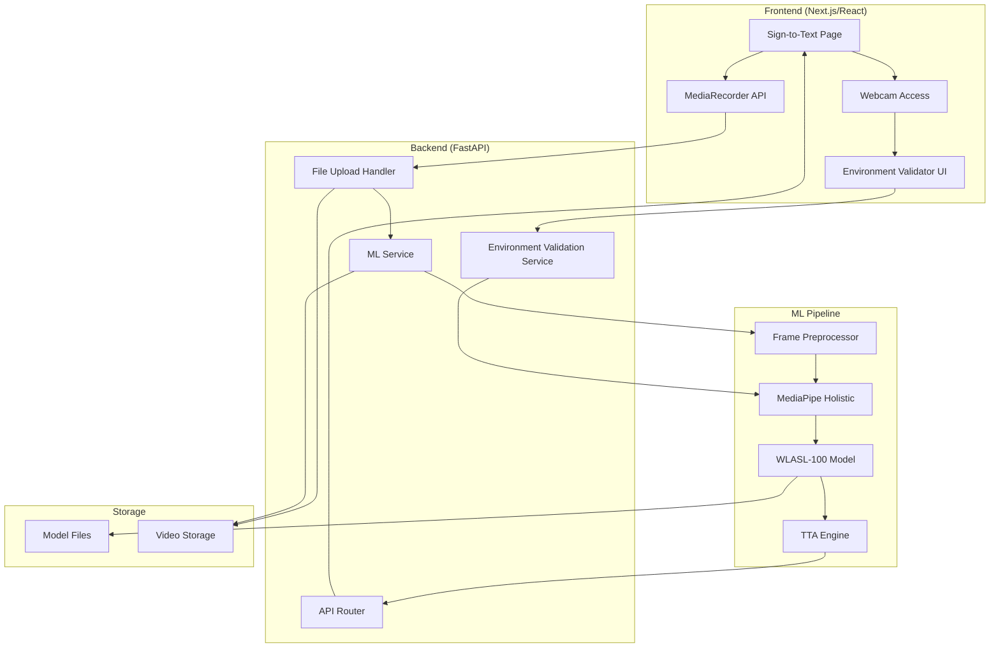
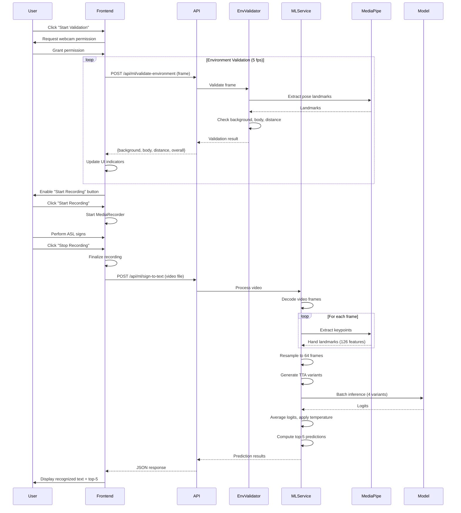

# Design Document: WLASL-100 Model Integration

## Overview

This design document specifies the architecture and implementation strategy for integrating the WLASL-100 ASL recognition model into the EmotiSign application. The integration replaces the placeholder `sign_to_text()` function with a production-ready sign language recognition system.

### System Scope

The integration encompasses:
- **Backend ML Service**: Model loading, keypoint extraction, inference pipeline with TTA
- **Environment Validation Service**: Pre-recording validation of background, body visibility, and distance
- **API Layer**: REST endpoints for video processing and environment validation
- **Frontend Recording Interface**: Webcam validation, video recording, upload, and result display

### Key Design Decisions

1. **Hands-Only Feature Set**: The model uses only hand keypoints (126 features) and drops pose features (99 features) to achieve framing invariance. Pose coordinates depend on camera framing (close-up vs waist-up), making them harmful for real-world generalization.

2. **TCN + BiGRU Architecture**: The model uses Temporal Convolutional Networks (TCN) for local motion features and Bidirectional GRU for long-range temporal dependencies. This architecture is better suited for small datasets (WLASL-100 has ~20 samples per class) compared to Transformers which require large datasets to learn useful attention patterns.

3. **Test-Time Augmentation (TTA)**: The system uses 4 sequence variants (center sample, speed-up, slow-down, horizontal mirror) to improve prediction robustness on real-world input.

4. **Pre-Recording Validation**: The system validates the recording environment before video capture to ensure optimal conditions for accurate recognition.

5. **Simplified Workflow**: The system follows a linear workflow: validate environment → record video → upload → process → get translation. This eliminates real-time streaming complexity while maintaining accuracy.

## Architecture

### System Components



### Data Flow



## Components and Interfaces

### 1. ML Service Module (`app/ml/ml_service.py`)

**Responsibilities:**
- Load and initialize the WLASL-100 model on application startup
- Manage MediaPipe Holistic extractor lifecycle
- Process video files and extract keypoint sequences
- Execute model inference with TTA
- Format prediction results

**Key Methods:**

```python
class WLASLModelService:
    """Service for WLASL-100 model inference."""
    
    def __init__(self, model_path: str, vocab_path: str, device: str):
        """Initialize model, vocabulary, and MediaPipe extractor."""
        
    async def load_model(self) -> None:
        """Load model checkpoint and vocabulary on startup."""
        
    async def extract_keypoints_from_video(self, video_path: str) -> np.ndarray:
        """
        Extract hand keypoints from video file.
        Returns: (num_frames, 126) array
        """
        
    def preprocess_frame(self, frame: np.ndarray) -> np.ndarray:
        """Apply CLAHE contrast normalization."""
        
    def extract_keypoints_from_frame(self, frame: np.ndarray) -> np.ndarray:
        """
        Extract hand landmarks using MediaPipe.
        Returns: (126,) array [left_hand(63) + right_hand(63)]
        """
        
    def resample_sequence(self, keypoints: np.ndarray, target_frames: int = 64) -> np.ndarray:
        """Resample keypoint sequence to target length."""
        
    def build_tta_variants(self, seq: np.ndarray) -> List[np.ndarray]:
        """
        Generate 4 TTA variants:
        1. Center sample
        2. Speed-up (first 85% of frames)
        3. Slow-down (last 85% of frames)
        4. Horizontal mirror (swap hands, flip x)
        """
        
    async def predict(self, keypoints: np.ndarray, use_tta: bool = True) -> dict:
        """
        Run inference with optional TTA.
        Returns: {
            "recognized_text": str,
            "glosses": List[str],
            "confidence": float,
            "top5_predictions": List[Tuple[str, float]],
            "frame_count": int,
            "processing_time_ms": int,
            "sign_language": "ASL"
        }
        """
        
    async def sign_to_text(self, video_path: str, use_tta: bool = True) -> dict:
        """
        Main entry point for sign-to-text translation.
        Orchestrates: video decode → keypoint extraction → inference
        """
```

### 2. Environment Validation Service (`app/services/environment_validator.py`)

**Responsibilities:**
- Validate background clarity using edge detection and texture analysis
- Verify body visibility (arms, hands, torso) using MediaPipe pose landmarks
- Estimate user distance from camera using shoulder width
- Provide real-time validation feedback

**Key Methods:**

```python
class EnvironmentValidator:
    """Service for pre-recording environment validation."""
    
    def __init__(self):
        """Initialize MediaPipe Holistic for pose detection."""
        
    def validate_background(self, frame: np.ndarray) -> dict:
        """
        Analyze background clarity.
        Returns: {
            "status": "clear" | "acceptable" | "cluttered",
            "score": float,  # 0.0-1.0
            "message": str
        }
        """
        
    def validate_body_visibility(self, frame: np.ndarray) -> dict:
        """
        Check if arms, hands, and torso are visible.
        Returns: {
            "status": "visible" | "partial" | "not_visible",
            "landmarks_detected": {
                "left_hand": bool,
                "right_hand": bool,
                "arms": bool,
                "torso": bool
            },
            "message": str
        }
        """
        
    def validate_distance(self, frame: np.ndarray) -> dict:
        """
        Estimate distance using shoulder width.
        Returns: {
            "status": "optimal" | "acceptable" | "out_of_range",
            "shoulder_width_px": int,
            "message": str
        }
        """
        
    async def validate_frame(self, frame: np.ndarray) -> dict:
        """
        Comprehensive validation of a single frame.
        Returns: {
            "background": {...},
            "body": {...},
            "distance": {...},
            "overall": "ready" | "not_ready"
        }
        """
```

### 3. API Router (`app/routers/ml_router.py`)

**Endpoints:**

```python
@router.post("/api/ml/sign-to-text")
async def sign_to_text_endpoint(
    video: UploadFile,
    use_tta: bool = True,
    ml_service: WLASLModelService = Depends(get_ml_service)
) -> dict:
    """
    Process uploaded video and return ASL translation.
    
    Request:
        - video: multipart/form-data video file (MP4, AVI, MOV, WEBM)
        - use_tta: optional boolean (default: true)
    
    Response:
        {
            "recognized_text": str,
            "glosses": List[str],
            "confidence": float,
            "top5_predictions": [[gloss, confidence], ...],
            "frame_count": int,
            "processing_time_ms": int,
            "sign_language": "ASL"
        }
    
    Errors:
        - 400: Invalid video format or file too large
        - 500: Processing error
    """

@router.post("/api/ml/validate-environment")
async def validate_environment_endpoint(
    frame: UploadFile,
    validator: EnvironmentValidator = Depends(get_validator)
) -> dict:
    """
    Validate recording environment from webcam frame.
    
    Request:
        - frame: image file (JPEG, PNG)
    
    Response:
        {
            "background": {
                "status": "clear" | "acceptable" | "cluttered",
                "score": float,
                "message": str
            },
            "body": {
                "status": "visible" | "partial" | "not_visible",
                "landmarks_detected": {...},
                "message": str
            },
            "distance": {
                "status": "optimal" | "acceptable" | "out_of_range",
                "shoulder_width_px": int,
                "message": str
            },
            "overall": "ready" | "not_ready"
        }
    """

@router.get("/api/ml/stats")
async def get_ml_stats(
    ml_service: WLASLModelService = Depends(get_ml_service)
) -> dict:
    """
    Get ML service statistics.
    
    Response:
        {
            "total_predictions": int,
            "average_inference_time_ms": float,
            "average_confidence": float,
            "model_loaded": bool,
            "device": str
        }
    """
```

### 4. Frontend Sign-to-Text Page (`src/app/translate/sign-to-text/page.tsx`)

**Component Structure:**

```typescript
interface ValidationState {
  background: {
    status: 'clear' | 'acceptable' | 'cluttered';
    message: string;
  };
  body: {
    status: 'visible' | 'partial' | 'not_visible';
    message: string;
  };
  distance: {
    status: 'optimal' | 'acceptable' | 'out_of_range';
    message: string;
  };
  overall: 'ready' | 'not_ready';
}

interface PredictionResult {
  recognized_text: string;
  glosses: string[];
  confidence: number;
  top5_predictions: [string, number][];
  frame_count: number;
  processing_time_ms: number;
  sign_language: string;
}

const SignToTextPage: React.FC = () => {
  // State management
  const [validationState, setValidationState] = useState<ValidationState | null>(null);
  const [isValidating, setIsValidating] = useState(false);
  const [isRecording, setIsRecording] = useState(false);
  const [isProcessing, setIsProcessing] = useState(false);
  const [result, setResult] = useState<PredictionResult | null>(null);
  const [error, setError] = useState<string | null>(null);
  
  // Refs
  const videoRef = useRef<HTMLVideoElement>(null);
  const mediaRecorderRef = useRef<MediaRecorder | null>(null);
  const validationIntervalRef = useRef<NodeJS.Timeout | null>(null);
  
  // Methods
  const startValidation = async () => { /* ... */ };
  const stopValidation = () => { /* ... */ };
  const sendFrameForValidation = async (frame: Blob) => { /* ... */ };
  const startRecording = async () => { /* ... */ };
  const stopRecording = () => { /* ... */ };
  const uploadVideo = async (videoBlob: Blob) => { /* ... */ };
  
  return (
    <div>
      {/* Validation UI */}
      {/* Recording UI */}
      {/* Results UI */}
    </div>
  );
};
```

## Data Models

### Keypoint Sequence Format

```python
# Raw keypoint array from MediaPipe
# Shape: (126,) per frame
keypoint_frame = np.array([
    # Left hand (21 landmarks × 3 coordinates = 63 features)
    lh_x0, lh_y0, lh_z0,  # Wrist
    lh_x1, lh_y1, lh_z1,  # Thumb CMC
    # ... (19 more landmarks)
    
    # Right hand (21 landmarks × 3 coordinates = 63 features)
    rh_x0, rh_y0, rh_z0,  # Wrist
    rh_x1, rh_y1, rh_z1,  # Thumb CMC
    # ... (19 more landmarks)
], dtype=np.float32)

# Sequence for model input
# Shape: (64, 126)
keypoint_sequence = np.array([
    keypoint_frame_0,
    keypoint_frame_1,
    # ... (62 more frames)
], dtype=np.float32)
```

### Model Configuration

```python
# Model architecture parameters
model_config = {
    "feature_dim": 126,        # Hands only (L + R)
    "num_classes": 100,        # WLASL-100 vocabulary
    "d_model": 192,            # Hidden dimension
    "nhead": 4,                # Unused (kept for API compatibility)
    "num_layers": 2,           # GRU layers
    "dim_feedforward": 256,    # MLP hidden size
    "dropout": 0.4,            # Dropout rate
    "max_seq_len": 64          # Sequence length
}

# Inference configuration
inference_config = {
    "use_tta": True,                    # Enable test-time augmentation
    "confidence_threshold": 0.25,       # Minimum confidence to display
    "temperature": 1.0,                 # Temperature scaling (loaded from file)
    "num_frames": 64,                   # Target sequence length
    "device": "cuda" if available else "cpu"
}
```

### Vocabulary Mapping

```json
{
  "0": "hello",
  "1": "thank",
  "2": "help",
  "3": "please",
  "4": "sorry",
  "5": "love",
  ...
  "99": "year"
}
```

### API Request/Response Schemas

```python
# Sign-to-text request
class SignToTextRequest(BaseModel):
    video: UploadFile
    use_tta: bool = True

# Sign-to-text response
class SignToTextResponse(BaseModel):
    recognized_text: str
    glosses: List[str]
    confidence: float
    top5_predictions: List[Tuple[str, float]]
    frame_count: int
    processing_time_ms: int
    sign_language: str = "ASL"

# Environment validation request
class ValidateEnvironmentRequest(BaseModel):
    frame: UploadFile

# Environment validation response
class ValidationResult(BaseModel):
    status: Literal["clear", "acceptable", "cluttered", "visible", "partial", 
                    "not_visible", "optimal", "out_of_range"]
    message: str
    score: Optional[float] = None
    shoulder_width_px: Optional[int] = None
    landmarks_detected: Optional[dict] = None

class ValidateEnvironmentResponse(BaseModel):
    background: ValidationResult
    body: ValidationResult
    distance: ValidationResult
    overall: Literal["ready", "not_ready"]
```

## Error Handling

### Error Categories and Responses

```python
class MLServiceError(Exception):
    """Base exception for ML service errors."""
    pass

class ModelLoadError(MLServiceError):
    """Raised when model files cannot be loaded."""
    pass

class KeypointExtractionError(MLServiceError):
    """Raised when MediaPipe fails to extract keypoints."""
    pass

class InferenceError(MLServiceError):
    """Raised when model inference fails."""
    pass

class VideoProcessingError(MLServiceError):
    """Raised when video file cannot be processed."""
    pass

# Error response format
{
    "error": str,           # Error message
    "error_type": str,      # Error category
    "details": dict,        # Additional context
    "timestamp": str        # ISO 8601 timestamp
}
```

### Error Handling Strategy

1. **Model Loading Errors**:
   - Log detailed error with file paths
   - Prevent application startup
   - Return HTTP 503 (Service Unavailable) if model not loaded

2. **Video Processing Errors**:
   - Validate file format and size before processing
   - Return HTTP 400 (Bad Request) for invalid input
   - Log warning and continue with zero-filled features if MediaPipe fails on individual frames

3. **Inference Errors**:
   - Catch PyTorch exceptions during forward pass
   - Return HTTP 500 (Internal Server Error)
   - Log full stack trace for debugging

4. **GPU Memory Errors**:
   - Catch CUDA out-of-memory exceptions
   - Fall back to CPU processing
   - Log warning about performance degradation

5. **Environment Validation Errors**:
   - Return partial validation results if some checks fail
   - Provide actionable feedback messages
   - Never block user from attempting recording

### Graceful Degradation

```python
async def sign_to_text_with_fallback(video_path: str) -> dict:
    """Sign-to-text with graceful degradation."""
    try:
        # Try with TTA (best accuracy)
        return await ml_service.sign_to_text(video_path, use_tta=True)
    except torch.cuda.OutOfMemoryError:
        logger.warning("GPU OOM, falling back to CPU")
        # Fall back to CPU
        ml_service.model.to("cpu")
        return await ml_service.sign_to_text(video_path, use_tta=True)
    except Exception as e:
        logger.error(f"TTA inference failed: {e}")
        # Fall back to single-variant inference
        return await ml_service.sign_to_text(video_path, use_tta=False)
```

## Testing Strategy

### Unit Testing

**ML Service Tests** (`tests/test_ml_service.py`):
- Test model loading with valid and invalid paths
- Test keypoint extraction from sample frames
- Test sequence resampling with various input lengths
- Test TTA variant generation
- Test prediction output format
- Test error handling for corrupted videos

**Environment Validator Tests** (`tests/test_environment_validator.py`):
- Test background validation with clear, cluttered, and edge-case images
- Test body visibility detection with various poses
- Test distance estimation with different shoulder widths
- Test overall validation logic

**API Tests** (`tests/test_ml_router.py`):
- Test sign-to-text endpoint with valid video
- Test sign-to-text endpoint with invalid formats
- Test environment validation endpoint
- Test stats endpoint
- Test CORS headers

### Integration Testing

**End-to-End Workflow Tests**:
1. Upload sample video → verify prediction format
2. Validate environment with test frames → verify all checks pass
3. Record video → upload → verify processing completes
4. Test with videos of varying lengths (5s, 15s, 30s)
5. Test with videos containing no hands → verify graceful handling

### Property-Based Testing

This feature is **NOT suitable for property-based testing** because:

1. **Infrastructure Integration**: The system integrates with MediaPipe (external library), PyTorch (external framework), and video codecs. These are external services whose behavior we don't control.

2. **Non-Deterministic ML Output**: Neural network predictions are not deterministic properties. The same input may produce slightly different outputs due to floating-point precision, hardware differences, and framework versions.

3. **Complex Input Space**: Valid ASL videos have complex constraints (proper framing, lighting, hand visibility) that cannot be easily generated randomly. Property-based testing requires generators that produce valid inputs, which is impractical for video data.

4. **Side-Effect Operations**: Video file I/O, GPU memory management, and MediaPipe processing involve side effects that are difficult to test with pure property-based approaches.

**Alternative Testing Strategies**:
- **Snapshot Testing**: Capture model outputs for a fixed set of test videos and verify consistency across runs
- **Schema Validation**: Verify API responses match expected schemas
- **Mock-Based Testing**: Mock MediaPipe and PyTorch to test business logic in isolation
- **Integration Tests**: Test with real sample videos covering edge cases (no hands, partial visibility, various speeds)

### Performance Testing

**Benchmarks**:
- Measure inference time with TTA on GPU (target: <500ms)
- Measure inference time with TTA on CPU (target: <2000ms)
- Measure keypoint extraction rate (target: >15 fps on CPU)
- Measure end-to-end latency for 10s video (target: <3s on GPU)

**Load Testing**:
- Simulate 10 concurrent video uploads
- Verify no memory leaks after 100 predictions
- Test GPU memory usage with batch processing

## Performance Considerations

### Optimization Strategies

1. **Model Optimization**:
   - Use `torch.jit.script` to compile model for faster inference
   - Enable `torch.cuda.amp` for mixed-precision inference on GPU
   - Batch TTA variants for parallel processing

2. **Video Processing**:
   - Decode video frames in parallel using threading
   - Skip frames if video FPS > 30 (downsample to 30 fps)
   - Use OpenCV hardware acceleration if available

3. **MediaPipe Optimization**:
   - Reuse MediaPipe Holistic instance across requests
   - Use `static_image_mode=False` for video processing
   - Set `model_complexity=2` for best accuracy (already configured)

4. **Caching**:
   - Cache model in memory (singleton pattern)
   - Cache vocabulary mapping
   - Consider caching predictions for identical videos (optional)

5. **Resource Management**:
   - Limit concurrent video processing to prevent GPU OOM
   - Use async/await for I/O-bound operations
   - Clean up temporary video files after processing

### Performance Targets

| Metric | Target (GPU) | Target (CPU) |
|--------|--------------|--------------|
| Model loading time | <5s | <15s |
| Keypoint extraction (per frame) | <20ms | <70ms |
| Inference with TTA (64 frames) | <300ms | <1500ms |
| End-to-end (10s video) | <2s | <8s |
| Environment validation (per frame) | <50ms | <150ms |

### Scalability Considerations

1. **Horizontal Scaling**:
   - Deploy multiple backend instances behind load balancer
   - Use shared storage for uploaded videos
   - Consider GPU-enabled instances for production

2. **Vertical Scaling**:
   - Use GPU with ≥8GB VRAM for production
   - Allocate ≥16GB RAM for video processing
   - Use SSD storage for faster video I/O

3. **Future Optimizations**:
   - Implement model quantization (INT8) for faster CPU inference
   - Use ONNX Runtime for cross-platform deployment
   - Consider TensorRT for maximum GPU performance
   - Implement request queuing for high-load scenarios

## Deployment and Configuration

### Environment Variables

```bash
# Model configuration
MODEL_PATH=app/ml/models/wlasl100/best_model.pth
VOCAB_PATH=app/ml/models/wlasl100/vocab.json
TEMPERATURE_PATH=app/ml/models/wlasl100/temperature.json
ML_DEVICE=cuda  # or cpu

# Inference configuration
USE_TTA=true
CONFIDENCE_THRESHOLD=0.25
NUM_FRAMES=64

# Video processing
MAX_VIDEO_SIZE_MB=50
MAX_VIDEO_DURATION_SEC=30
UPLOAD_DIR=uploads/videos

# Performance
MAX_CONCURRENT_PREDICTIONS=5
ENABLE_MODEL_CACHE=true
```

### Dependency Installation

```bash
# Install PyTorch (CUDA 11.8)
pip install torch==2.0.1 torchvision==0.15.2 --index-url https://download.pytorch.org/whl/cu118

# Install MediaPipe (specific version for compatibility)
pip install mediapipe==0.9.3

# Install other dependencies
pip install opencv-python==4.8.1.78 numpy==1.24.3

# Verify installation
python -c "import torch; print(f'PyTorch: {torch.__version__}, CUDA: {torch.cuda.is_available()}')"
python -c "import mediapipe; print(f'MediaPipe: {mediapipe.__version__}')"
```

### Model File Setup

```bash
# Create model directory
mkdir -p emotisign-backend/app/ml/models/wlasl100

# Copy model files
cp Model/best_model.pth emotisign-backend/app/ml/models/wlasl100/
cp Model/vocab.json emotisign-backend/app/ml/models/wlasl100/
cp Model/temperature.json emotisign-backend/app/ml/models/wlasl100/  # if available

# Verify files
ls -lh emotisign-backend/app/ml/models/wlasl100/
```

### Health Check Script

```python
# health_check.py
import torch
import mediapipe as mp
import os

def check_model_files():
    """Verify model files exist."""
    required_files = [
        "app/ml/models/wlasl100/best_model.pth",
        "app/ml/models/wlasl100/vocab.json"
    ]
    for file_path in required_files:
        if not os.path.exists(file_path):
            print(f"❌ Missing: {file_path}")
            return False
        print(f"✓ Found: {file_path}")
    return True

def check_gpu():
    """Check GPU availability."""
    if torch.cuda.is_available():
        print(f"✓ GPU available: {torch.cuda.get_device_name(0)}")
        print(f"  CUDA version: {torch.version.cuda}")
        print(f"  GPU memory: {torch.cuda.get_device_properties(0).total_memory / 1e9:.2f} GB")
        return True
    else:
        print("⚠ No GPU available, will use CPU")
        return False

def check_mediapipe():
    """Verify MediaPipe can initialize."""
    try:
        holistic = mp.solutions.holistic.Holistic()
        holistic.close()
        print("✓ MediaPipe initialized successfully")
        return True
    except Exception as e:
        print(f"❌ MediaPipe error: {e}")
        return False

if __name__ == "__main__":
    print("=== EmotiSign ML Service Health Check ===\n")
    checks = [
        check_model_files(),
        check_gpu(),
        check_mediapipe()
    ]
    print(f"\n{'✓ All checks passed' if all(checks) else '❌ Some checks failed'}")
```

## Security Considerations

### Input Validation

1. **Video File Validation**:
   - Verify file extension matches content type
   - Limit file size to 50MB
   - Validate video duration ≤30 seconds
   - Scan for malicious content (optional)

2. **Frame Validation**:
   - Verify image format for environment validation
   - Limit frame size to reasonable dimensions (e.g., 1920×1080)
   - Sanitize file names to prevent path traversal

### Resource Protection

1. **Rate Limiting**:
   - Limit requests per user per minute
   - Implement exponential backoff for repeated failures
   - Use token bucket algorithm for burst handling

2. **Resource Quotas**:
   - Limit concurrent video processing per user
   - Set maximum GPU memory per request
   - Implement request timeout (e.g., 30s)

3. **File Cleanup**:
   - Delete uploaded videos after processing
   - Implement automatic cleanup of old files
   - Use temporary directories with restricted permissions

### Data Privacy

1. **Video Storage**:
   - Store videos temporarily only during processing
   - Delete videos immediately after inference
   - Do not log video content or keypoints

2. **Prediction Logging**:
   - Log only aggregated statistics (no user-specific data)
   - Anonymize any logged information
   - Implement log rotation and retention policies

## Future Enhancements

### Short-Term (Next Sprint)

1. **Confidence Calibration**:
   - Implement temperature scaling calibration on validation set
   - Store calibrated temperature in `temperature.json`
   - Improve confidence score reliability

2. **Expanded Vocabulary**:
   - Train model on WLASL-300 or WLASL-2000
   - Implement vocabulary versioning
   - Support multiple model versions

3. **Performance Monitoring**:
   - Add Prometheus metrics for inference time, confidence, throughput
   - Implement alerting for degraded performance
   - Create Grafana dashboard for visualization

### Medium-Term (Next Quarter)

1. **Real-Time Streaming**:
   - Implement WebSocket-based streaming inference
   - Use sliding window for continuous recognition
   - Add temporal smoothing for stable predictions

2. **Multi-Language Support**:
   - Train models for PSL (Pakistan Sign Language)
   - Implement language detection
   - Support language selection in UI

3. **Model Optimization**:
   - Quantize model to INT8 for faster CPU inference
   - Export to ONNX for cross-platform deployment
   - Implement TensorRT optimization for GPU

### Long-Term (Future Roadmap)

1. **Continuous Learning**:
   - Collect user feedback on predictions
   - Implement active learning pipeline
   - Retrain model with user-contributed data

2. **Advanced Features**:
   - Sentence-level recognition (multi-sign sequences)
   - Emotion detection from facial expressions
   - Context-aware translation

3. **Mobile Deployment**:
   - Export model to TorchScript Mobile
   - Implement on-device inference for iOS/Android
   - Optimize for mobile GPU (Metal, OpenCL)

---

**Document Version**: 1.0  
**Last Updated**: 2025-01-28  
**Author**: Kiro AI Agent  
**Status**: Ready for Review
